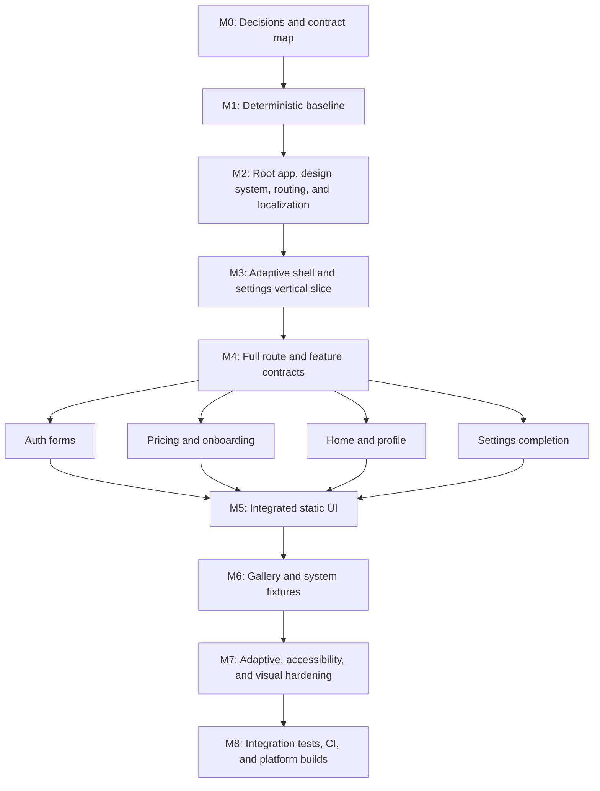

# Initial Implementation Workflow

**Status:** Ready to execute

**Prepared:** 21 July 2026

**Source plans:** [initial.md](initial.md) and [initial_ui.md](initial_ui.md)

**Goal:** Replace the stock counter with the smallest verified architecture spine, then build the
static UI in dependency order while using short-lived sub-agents only at stable, disjoint work
boundaries.

---

## 1. Starting point

The repository is a clean Flutter template on `master`.

- Local Flutter is `3.44.7` and Dart is `3.12.2`, matching the planned toolchain.
- `lib/main.dart` and `test/widget_test.dart` are still the generated counter example.
- `pubspec.yaml` has no planned application dependencies.
- Analysis uses the default `flutter_lints` configuration.
- Android, iOS, macOS, Windows, Linux, and web scaffolds exist.
- There is no bootstrap, configuration, router, feature structure, localization, settings
  persistence, gallery, integration test, golden harness, or CI configuration.
- The existing format, analysis, and counter test baseline passes.

This means implementation can begin at the architecture prerequisites. No legacy migration or
compatibility layer is needed.

Web remains optional. Do not add it to the required CI matrix until it is explicitly retained; if
retained, remove its template orientation lock and make it follow the same adaptive contract.

---

## 2. Execution principles

1. Build vertical, executable slices. Every slice adds its tests and leaves format and analysis
   green.
2. Keep the project feature-first. Do not split agents by presentation, state, and data layers.
3. Keep widgets lean, feature controllers responsible for user intent, repositories responsible
   for feature behavior, and vendor APIs inside concrete infrastructure adapters.
4. Add a package in the same slice as its first real caller and test.
5. Keep ephemeral state local. Use Riverpod for shared, persisted, asynchronous, or cross-widget
   state.
6. Do not create folders, ports, repositories, or services before a real caller establishes the
   boundary.
7. The root/integration owner is the only writer for high-conflict composition files and generated
   output.
8. Complete Login and Register before extracting any shared form API.
9. Run a repository-wide integration checkpoint between every parallel work wave.

The implementation dependency graph is:



---

## 3. Ownership model

### 3.1 Root/integration owner

The root owner keeps exclusive control of:

- `pubspec.yaml` and `pubspec.lock`
- `analysis_options.yaml`
- `lib/main.dart`, `lib/bootstrap.dart`, `lib/app/app.dart`, and
  `lib/app/dependencies.dart`
- `lib/app/routing/**` and app-shell contracts
- `slang.yaml`, translation source files, and generated localization output
- generated ForUI theme output and shared theme/motion/adaptive contracts
- shared form helpers and common test/golden harnesses
- gallery registry assembly
- integration-test bootstrap and cross-feature navigation wiring

Sub-agents may recommend changes to these files but do not edit them while working in parallel.

### 3.2 Feature owners

After contracts are frozen, a feature sub-agent receives exclusive ownership of named feature and
test directories. It may not edit another feature, `shared/**`, routing, dependencies, translations,
generated files, or goldens unless the task packet explicitly transfers that ownership.

### 3.3 Sub-agent task packet

Every spawned task must state:

- one bounded outcome;
- frozen input APIs and assumptions;
- allowed file paths;
- forbidden high-conflict paths;
- required unit/widget tests;
- verification commands;
- the expected completion report, including proposed shared abstractions and unresolved blockers.

Because agents share one working tree, the root owner must not edit an active agent's owned paths.
Agents do not commit independently. The root owner reviews the diff, integrates it, runs the gate,
and only then starts the next wave.

---

## 4. Dynamic sub-agent policy

There are four execution slots: the root owner plus at most three sub-agents.

Spawn a sub-agent only when all of these are true:

1. Its inputs are stable enough that it should not need to redesign a shared contract.
2. It has exclusive paths that do not overlap another active writer.
3. It has a measurable acceptance test.
4. The task is large enough to be a complete focused implementation or audit slice.
5. At least one other ready task can progress independently.

Do not keep standing role agents. Retire each agent after its bounded deliverable, then reuse the
slot for the next ready node. Use the same agent for a direct follow-up when continuity matters,
such as implementing the remaining auth forms after its Login/Register comparison.

Do not parallelize:

- dependency or lockfile edits;
- bootstrap, app composition, providers, or router assembly;
- translation JSON or generated-code changes;
- theme/token changes;
- shared form extraction;
- gallery registry edits;
- golden baseline updates;
- fixes that span multiple features.

Read-only research or audit agents are safe earlier than implementation agents. Examples include
ForUI compatibility review, Noto font/license inventory, platform toolchain audit, and CI failure
classification.

---

## 5. Milestones

### M0 — Decisions and contract map

**Owner:** Root only; optional read-only research agents.

Record these decisions before code begins:

- Web is optional and excluded from the required first CI matrix.
- Select the local Flutter pin mechanism and record Flutter `3.44.7` in CI.
- Select source-controlled, license-reviewed Noto font families and weights for Latin, Arabic, and
  Simplified Chinese before accepting locale goldens.
- Record CI runner images and minimum platform/toolchain versions.
- Freeze route names/paths, cross-feature callback or typed-intent signatures, settings state,
  `AppLayoutClass`, `AppInteractionPolicy`, and the initial spacing/size/motion tokens.
- Confirm that only settings persist during the static phase.

**Gate:** A file-level backlog and ownership map exist, and no feature needs a fake backend,
authentication state, purchase service, OTP service, upload service, or onboarding-completion store.

### M1 — Deterministic baseline

**Owner:** Root only.

Implementation slice:

1. Declare Dart `^3.12.0` and Flutter `>=3.44.0 <3.45.0`.
2. Replace `flutter_lints` with `very_good_analysis`, strict casts/inference/raw types, page width
   `100`, generated exclusions, and native `riverpod_lint` `3.1.4`.
3. Add `config/development.json`, `config/staging.json`, and `config/production.json` with
   `APP_ENV`, `ENABLE_VERBOSE_LOGGING`, and `ENABLE_DEV_TOOLS`.
4. Implement and unit-test `AppEnvironment` and `AppConfig` parsing, including missing, unknown,
   and production-safety cases.
5. Replace the counter entrypoint with `main() -> AppConfig.fromEnvironment() -> bootstrap(config)`.
6. Add the minimal recoverable bootstrap error boundary and redacted logger caller needed by the
   new entrypoint.
7. Remove the generated counter test and replace it with configuration/bootstrap-focused tests.

**Gate:**

```bash
dart format --output=none --set-exit-if-changed .
flutter analyze --fatal-infos
flutter test test
```

Missing or invalid environment configuration must fail actionably, tests must construct explicit
configuration fixtures, and production must never fall back to development.

### M2 — Root app, design system, routing, and localization

**Owner:** Root; bounded pure-logic or research agents may run after public types are frozen.

Implementation slice:

1. Add Riverpod, ForUI, `go_router`, Slang, Flutter localization delegates, and Talker with their
   first callers.
2. Generate and commit ForUI theme files. Add application spacing, size, typography, density, and
   motion tokens without wrapping every ForUI primitive.
3. Add Slang configuration and the smallest complete `en`, `ar`, and `zh-Hans` source set; generate
   and commit output.
4. Compose `ProviderScope`, Slang, `MaterialApp.router`, ForUI theme, toaster, and tooltip roots.
5. Add the centralized named router with Home, localized unknown-route recovery, conditional Back,
   and a development-only diagnostics placeholder.
6. Add a minimal Home page to prove startup, routing, themes, locales, and ForUI delegate wiring.
7. Prove `/dev/*` routes are physically absent under production configuration.

**Safe dynamic tasks after contracts freeze:**

- Agent A: implement `AppLayoutClass` and `AppInteractionPolicy` pure logic plus unit tests.
- Agent B: implement log redaction tests or perform the font/license inventory in exclusive paths.
- Agent C: audit platform templates and draft CI/toolchain requirements without editing root files.

**Gate:** Root widget tests render a ForUI control in all three locales; Arabic is RTL; unknown
routes recover without redirect loops; production route tests cannot resolve development routes;
format, analysis, generation-drift, and targeted tests pass.

### M3 — Adaptive shell and settings vertical slice

**Owner:** Root owns settings and integration. A completed adaptive-logic agent may be followed up
for shell-specific tests after the shell API is stable.

Implementation slice:

1. Add compact, medium, and expanded shell selection from ForUI `sm` and `lg` breakpoint tokens.
2. Keep width class, input policy, and platform capability separate.
3. Add compact and expanded shell widgets with keyboard, pointer, touch, and hybrid behavior.
4. Implement handwritten settings state and controller.
5. Implement the feature-owned `SettingsStore`, settings repository, and in-memory test store.
6. Add the `SharedPreferencesAsync` adapter as the only production plugin boundary.
7. Add appearance and language screens for theme, accent, app font multiplier, motion preview, and
   locale override.
8. Add one purposeful reduced-motion-aware Simple Animations transition and one short token-based
   ExUI layout caller.

**Gate:** Settings persist through a reconstructed production dependency graph; invalid saved
values fall back safely; plugin errors map to application failures; resize does not reset route or
settings state; widths immediately below and at `640` and `1024` classify correctly; nonlinear
system scaling remains active.

### M4 — Full route and feature contracts

**Owner:** Root only for contracts and shared files; read-only agents may review the contracts.

Before parallel feature work:

1. Add the complete route tree from `initial_ui.md`.
2. Parse `OtpPurpose` once and route invalid or missing values to the recovery view.
3. Freeze cross-feature callbacks or typed navigation intents; features do not import foreign route
   constants.
4. Add translation namespaces and realistic initial copy for every planned screen.
5. Freeze immutable view-data conventions and deterministic presentation-state conventions.
6. Define the production-page factory contract needed by typed gallery cases, without building
   gallery-only substitute widgets.
7. Add initial shared content-width tokens: `480`, `720`, and `1200`.

**Gate:** Each feature can be implemented without touching routing, translations, shared tokens,
dependencies, or another feature's internals.

### M5 — Parallel static feature wave

**Owner:** Root plus up to three feature agents.

Recommended first wave:

| Agent | Exclusive implementation scope | Required result |
| --- | --- | --- |
| A — Auth | `lib/features/auth/**`, `test/features/auth/**` | Login, then Register, with native forms, typed values, validation, focus/reveal, keyboard/autofill behavior, dirty Register handling, and deterministic states. |
| B — Pricing/onboarding | `lib/features/pricing/**`, `lib/features/onboarding/**`, matching feature tests | Shared pricing-owned plan components, full Pricing, paywall with honest static actions, and three-page onboarding with Skip/Continue callbacks. |
| C — Home/profile | `lib/features/home/**`, `lib/features/profile/**`, matching feature tests | Adaptive Home content and Update Profile with typed draft, dirty/discard behavior, deterministic save states, and no upload permission/service. |

While agents work, the root owner completes the Settings sections and prepares router integration
without editing agent-owned paths.

Integration order:

1. Review and integrate Auth Login/Register.
2. Compare the two forms. Root extracts only helpers with two matching callers.
3. Follow up with the Auth agent for Forgot Password, OTP, and Reset Password using the agreed form
   boundary.
4. Integrate Pricing/Onboarding, then Home/Profile.
5. Wire all callbacks and routes centrally.
6. Run the full repository gate before beginning another parallel wave.

**Gate:** All screens are directly addressable; all static flows reach the correct typed
destinations; resizing preserves form/pager/billing state; no fake service or extra form package
exists; feature tests, repository tests, format, and analysis pass.

### M6 — Development gallery and system fixtures

**Owner:** Root plus short-lived agents after production page APIs exist.

Recommended wave:

- Agent A: `features/dev_gallery/**` and its tests, excluding central registry assembly. Implement
  the preview frame and controls for viewport, locale, app/system scaling, interaction policy,
  motion, contrast, bold text, safe areas, insets, and display features.
- Agent B: typed, screen-specific gallery cases in an assigned registry segment. Cases must build
  production pages with immutable state and callbacks.
- Agent C: diagnostics and overlay fixture tests in exclusive development-only paths.
- Root: startup/route error surfaces, final gallery registry, route gating, and cross-feature
  integration.

**Gate:** Required cases are deterministic and use no timers or fake repositories; every enabled
placeholder action gives honest feedback; gallery and diagnostics are absent from production.

### M7 — Adaptive, accessibility, and visual hardening

**Owner:** Root triages; sub-agents audit orthogonal concerns and own disjoint test files.

Recommended wave:

- Agent A: responsive resize, boundary, short-height, keyboard-inset, safe-area, foldable, RTL,
  and nonlinear text-scale audit.
- Agent B: form focus order, keyboard submission, autofill, dirty state, semantics, touch target,
  high-contrast, bold-text, and screen-reader behavior audit.
- Agent C: golden harness and pairwise golden-case implementation after fonts, renderer, DPR,
  themes, and motion are stable.

Agents should report cross-feature production fixes to the root owner. A feature agent may patch a
defect only when the fix remains entirely inside its exclusive feature path.

**Gate:** Widget accessibility guidelines and targeted contrast assertions pass; the approved
golden matrix is reviewed; animation-disabled fixtures settle immediately; core flows pass manual
keyboard, pointer, RTL, maximum scaling, and screen-reader review.

### M8 — Integration tests, CI, and platform builds

**Owner:** Root integrates. One sub-agent may exclusively own CI workflow and documentation files.

Implementation slice:

1. Add `development_smoke_test.dart` using the production composition path and explicit development
   configuration.
2. Add the independent `production_routes_test.dart` proving `/dev/screens` and
   `/dev/diagnostics` are unregistered.
3. Add generated-code drift detection.
4. Run the deterministic Linux integration target under Xvfb in CI.
5. Add Android/Linux builds on Ubuntu, iOS/macOS builds on macOS, and Windows builds on Windows,
   always with explicit production configuration.
6. Update README with environment commands, pinned runner/toolchain versions, supported targets,
   and the golden-update review process.
7. Keep signing, final identifiers/icons, telemetry, consent, and native workflow testing in the
   release-readiness backlog unless separately activated.

Use agents to classify independent platform failures after CI reports them. Do not assume agents on
the shared macOS workspace can locally validate Linux or Windows runners.

**Final gate:**

```bash
flutter pub get
dart format --output=none --set-exit-if-changed .
flutter analyze --fatal-infos
dart run build_runner build --delete-conflicting-outputs
git diff --exit-code
flutter test test
```

Both integration targets must pass with explicit environment files, and every required platform
release build must pass with `config/production.json`.

---

## 6. Integration checkpoint protocol

After every agent finishes:

1. Confirm no forbidden or unrelated files changed.
2. Review behavior and tests before refactoring style.
3. Apply shared-contract changes centrally only after two real callers prove the need.
4. Regenerate ForUI/Slang output only from the root owner.
5. Run formatting, fatal-info analysis, the agent's targeted tests, then the complete test suite.
6. Inspect dependency resolution after dependency changes, especially Riverpod `3.3.x` alongside
   `riverpod_lint` `3.1.x`.
7. Record follow-up risks rather than weakening a gate or broadening an abstraction.
8. Start the next agent wave only from a green working tree.

---

## 7. First implementation kickoff

The first coding session should complete only M1 and stop at its green gate:

- update SDK constraints and strict analysis;
- add the three explicit environment files;
- implement `AppEnvironment` and `AppConfig` with focused unit tests;
- replace the counter with the one-entrypoint bootstrap skeleton;
- add minimal startup failure and logging behavior needed by that skeleton;
- remove the counter test;
- run format, fatal-info analysis, and the complete current test suite.

Do not spawn write-capable feature agents during this first slice. If spare capacity is useful, use
read-only agents for the font/license inventory, ForUI/Slang compatibility review, and CI runner
audit. Begin implementation sub-agents only after M2 freezes the shared UI, localization, routing,
and adaptive contracts.

---

## 8. Completion criteria

Implementation is complete when the definitions of done in both source plans pass, including:

- explicit environment safety and one entrypoint;
- ForUI-only styled components and disciplined ExUI/Simple Animations usage;
- compact, medium, and expanded layouts with state-preserving resize;
- injectable touch, pointer, hybrid, and keyboard policies;
- persistent theme, accent, app font multiplier, and locale settings;
- English, Arabic RTL, and Simplified Chinese localization with bundled deterministic fonts;
- every listed static route, form state, recovery surface, and development gallery case;
- no fake backend or speculative infrastructure;
- reviewed unit, widget, golden, integration, accessibility, and manual checks;
- development routes absent from production; and
- generated-code drift checks plus required Android, iOS, macOS, Windows, and Linux builds in CI.

