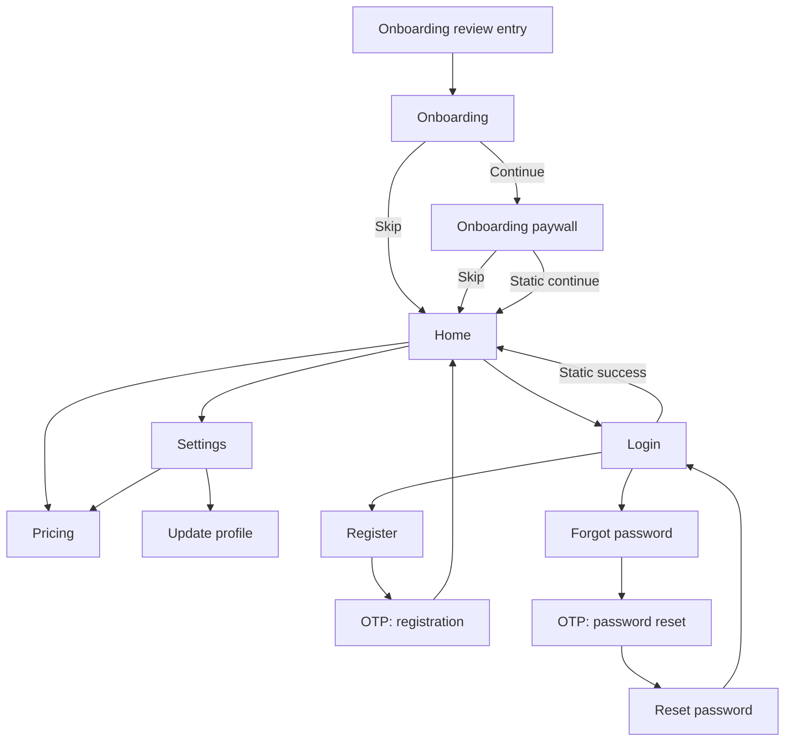

# Initial Static UI Screen Plan

**Status:** Audited implementation plan

**Scope:** Static, navigable screens used to exercise the starter architecture

**Baseline date:** 21 July 2026

**Targets:** Phone, tablet, resizable desktop, and optionally web

This document is a companion to [initial.md](initial.md). The architecture plan remains the source of truth for dependency direction, environments, package boundaries, and adaptive layout policy.

---

## 1. Purpose

Build a coherent set of static screens before connecting authentication, billing, profile, or product backends.

The screens provide enough realistic UI to evaluate:

- Feature-first folder boundaries.
- Compact, medium, and expanded layouts.
- Touch, mouse, and keyboard behavior.
- ForUI component coverage and missing design tokens.
- ExUI and Dartx usage discipline.
- Simple Animations and reduced-motion behavior.
- Native Flutter form integration through ForUI's existing `FormField` APIs.
- Shared form abstractions based on repeated usage rather than prediction.
- English, Arabic, and Simplified Chinese localization.
- RTL, text scaling, focus traversal, validation, and error presentation.
- Screen-level golden tests and a development UI gallery.

The output is a reusable visual and structural baseline, not a production authentication or subscription system.

### 1.1 Audited decisions

| Area | Decision | Reason |
| --- | --- | --- |
| Form state | Use Flutter `Form`/`FormField` with ForUI form widgets | `FTextFormField`, `FOtpField`, selects, date/time fields, and other ForUI controls already expose native form behavior. |
| Form controls | Start managed/internal; use managed/external or lifted controls only when a screen requires them | This follows ForUI's control model and avoids two competing owners for a field value. |
| Extra form package | Add none during the static UI phase | Reactive Forms is capable, but it requires ForUI adapters and a second form-state model without solving a current requirement. |
| Shared form API | Extract submit/focus helpers and non-form-field wrappers only after Login and Register | Do not hide ForUI's native form widgets behind pass-through application wrappers. |
| Navigation ownership | The app router composes cross-feature flows and passes callbacks/intents into pages | Feature pages must not import another feature's routes or the development gallery. |
| Gallery state | Use typed, screen-specific gallery cases | A generic scenario enum cannot represent focused, partial OTP, expired, dirty, billing-period, or route-error variants safely. |

Re-evaluate a dedicated form engine only when real product forms require dynamic field arrays, nested/multi-step form graphs, coordinated asynchronous validation, or reusable server-error/dirty/reset orchestration that native forms no longer express cleanly.

---

## 2. Included screens

```text
Onboarding
Onboarding paywall with Skip
Home
Settings
Login
Register
Forgot password
OTP verification
Reset password
Update profile
Pricing
Development screen gallery
```

Settings continues to include appearance and language controls from the architecture baseline.

Supporting application surfaces are also required for a trustworthy baseline:

```text
Recoverable startup failure
Unknown/invalid route
Development diagnostics
Dialog, sheet, toast, popover, and tooltip gallery cases
```

### 2.1 Explicit non-goals

This phase does not implement:

- A real authentication provider or session.
- Social login.
- Network requests or a fake API layer.
- Email or SMS delivery.
- Real OTP verification.
- Password reset tokens.
- In-app purchases, checkout, receipt restoration, or subscription status.
- Avatar upload or file permissions.
- Remote pricing or feature flags.
- Persistent onboarding completion.
- Route guards that pretend a user is authenticated.

Static form submission may validate, show deterministic UI feedback, and navigate to the next demo screen. It must not introduce repositories or services with no real external behavior.

---

## 3. What this phase should teach us

At the end of the static build, review these questions:

1. Which layout patterns are actually repeated across screen families?
2. Which widgets are genuinely shared versus merely similar?
3. Does the app shell remain stable while the window resizes?
4. Are ForUI's touch and desktop variants sufficient for every screen?
5. Which native form behavior deserves a shared helper, and which belongs to the feature?
6. Can every validation and error state be localized cleanly?
7. Do Arabic RTL and maximum text scale expose assumptions in spacing or navigation?
8. Are keyboard, hover, focus, and submit behaviors good enough for desktop?
9. Is any ExUI or Dartx extension hiding important behavior?
10. Does custom motion improve comprehension and still work with animations disabled?

Record the answers before adding backend integrations.

---

## 4. Route map

### 4.1 Routes

| Route | Screen | Notes |
| --- | --- | --- |
| `/onboarding` | Onboarding | Three static introduction pages. |
| `/onboarding/paywall` | Onboarding paywall | Uses pricing-feature content and always exposes Skip. |
| `/` | Home | Main shell destination. |
| `/settings` | Settings overview | Compact list or expanded two-pane settings. |
| `/settings/appearance` | Appearance settings | Theme, accent, text scale, and motion preview. |
| `/settings/language` | Language settings | System, English, Arabic, and Chinese. |
| `/auth/login` | Login | Entry to the static authentication flow. |
| `/auth/register` | Register | Leads to registration OTP. |
| `/auth/forgot-password` | Forgot password | Leads to reset OTP. |
| `/auth/otp/:purpose` | OTP | Typed purpose path value: `registration` or `password-reset`. |
| `/auth/reset-password` | Reset password | Leads back to login after static success. |
| `/profile/edit` | Update profile | Static account details form. |
| `/pricing` | Pricing | Full plan comparison outside onboarding. |
| `/dev/screens` | Screen gallery | Development builds only. |
| `/dev/diagnostics` | Diagnostics | Development builds only. |
| Router error builder | Unknown/invalid route | Localized recovery view; not a redirect loop. |

### 4.2 Navigation flow



### 4.3 Route rules

- Routes are named and centralized in `app_routes.dart`.
- The normal static app starts at Home. Onboarding remains directly addressable; the flowchart is a review flow, not a claim that onboarding completion is persisted.
- Home, Pricing, and Settings are shell destinations. Compact navigation pushes settings detail pages; expanded navigation selects a detail pane without changing feature state.
- Use a stateful shell only if separate destination stacks must survive switching; do not add it merely because `go_router` supports it.
- The OTP purpose is parsed once into `OtpPurpose.registration` or `OtpPurpose.passwordReset`. Missing or invalid values render the router error view.
- Static screens remain directly addressable for development and golden tests.
- `/dev/screens` and `/dev/diagnostics` are added only when `AppEnvironment.development` and the explicit development-tools flag are enabled. They are absent from the production route table, including profile/release builds.
- Static flows do not introduce fake authentication redirects.
- Back navigation must behave naturally on Android, iOS, desktop, and web if supported. The recovery page shows Back only when `GoRouter.canPop()` is true; a cold-start unknown location offers Home without attempting an invalid pop.
- The app router owns cross-feature composition. It passes callbacks such as `onOpenPricing` or typed navigation intents into feature pages; feature files do not import another feature's route constants.
- Unknown routes, malformed route locations, and router exceptions render a localized recovery surface with Home and a conditional Back action.
- The baseline tests direct router initial locations and does not claim OS-level universal/app-link registration. External links and desktop URL schemes follow the activation rules in section 15.1 of [initial.md](initial.md).
- Flutter route/draft restoration is deferred. If activated later, it requires stable restoration IDs, restart-and-restore tests, and a strict allowlist; passwords, OTP codes, and reset tokens must never enter restoration data.

---

## 5. Screen inventory

| Screen | Primary content | Required static states |
| --- | --- | --- |
| Onboarding | Illustration/visual, title, body, progress, next/skip | First, middle, final page; compact and expanded |
| Paywall | Benefits, billing choice, plan CTA, restore/legal placeholders, Skip | Monthly, annual, selected, disabled/reduced motion |
| Home | Greeting, quick actions, status cards, recent activity placeholder | Default, empty recent activity, wide/narrow |
| Settings | Section navigation and detail content | Compact list, medium, expanded two-pane |
| Login | Email, password, remember option, forgot/register links | Idle, invalid, submitting, global failure, success |
| Register | Name, email, password, confirmation, terms | Idle, invalid, submitting, field failure, success |
| Forgot password | Email and instructions | Idle, invalid, submitting, success |
| OTP | Six-digit code, resend, destination context | Empty, partial, complete, invalid, expired, submitting |
| Reset password | New password and confirmation | Idle, weak/mismatch, submitting, success |
| Update profile | Avatar placeholder, display name, username, read-only email, bio | Default, dirty, invalid, saving, success |
| Pricing | Plan cards, billing choice, comparison, FAQ/legal placeholders | Compact stack, medium grid, expanded grid |
| Startup failure | Localized error, safe diagnostics ID, retry/exit guidance | Recoverable and non-recoverable fixtures |
| Route error | Invalid path/purpose context and recovery actions | Unknown path, malformed OTP purpose |
| Diagnostics | Redacted app/build/layout/input/locale capability data | Compact and expanded |

Every state is deterministic and selectable in tests or the development screen gallery.

---

## 6. Screen specifications

### 6.1 Onboarding

Use three concise pages:

1. A primary value proposition.
2. A cross-device/adaptive experience explanation.
3. A privacy/control or personalization explanation.

Required elements:

- Brand mark or neutral placeholder visual.
- Localized title and body.
- Page progress indicator.
- Back and Continue controls where applicable.
- Skip control that goes directly to Home.
- Final Continue action that opens the onboarding paywall.

Layout behavior:

- Compact: vertical pager with controls pinned safely below the content.
- Medium: centered panel with a larger visual region.
- Expanded: split layout with visual/brand content on one side and copy/actions on the other.

Use a local `PageController`; onboarding page index is ephemeral presentation state and does not need Riverpod.

### 6.2 Onboarding paywall

The paywall is part of the pricing feature even though it appears in the onboarding route flow. This keeps plan data, billing selection, pricing cards, and comparison behavior together.

Required elements:

- Clear Skip action visible without scrolling.
- Localized headline and benefit list.
- Monthly/annual billing selector.
- One highlighted recommended plan.
- Primary static CTA.
- Restore-purchase placeholder that opens an honest “not connected” toast or dialog.
- Terms and privacy links that open deterministic localized placeholder pages or dialogs.
- Honest note that purchasing is not connected in the static phase.

The static CTA may show a success toast and continue to Home. It must not imply that a purchase occurred.

### 6.3 Home

The Home screen exists to exercise the application shell rather than define a product domain prematurely.

Use neutral modules:

- Greeting and compact status summary.
- Quick actions linking to Profile, Pricing, and Settings.
- A small feature/status card grid.
- A recent activity or getting-started section with an empty variant.

Layout behavior:

- Compact: single-column scroll with bottom navigation.
- Medium: navigation rail/narrow sidebar and a two-column card grid.
- Expanded: persistent sidebar, constrained header, and a wider dashboard grid.

Do not introduce repositories for placeholder Home content. Pass immutable view data directly to the page/content widget.

### 6.4 Settings

Initial sections:

```text
Appearance
Language
Account
Subscription
Privacy and About
```

Behavior:

- Appearance controls update the existing theme, accent, text-scale, and motion preview state.
- Language changes between system, English, Arabic, and Simplified Chinese.
- Account links to Update Profile and Login.
- Subscription links to Pricing.
- Privacy/About contains static explanatory copy, deterministic legal placeholders, and build information.

Layout behavior:

- Compact: section list navigates to full-screen detail routes.
- Medium: section list plus a flexible detail area when space permits.
- Expanded: persistent settings navigation and constrained detail panel.

Use the same settings state and controller for every layout.

### 6.5 Login

Fields:

```text
email
password
rememberMe
```

Actions:

- Submit.
- Forgot password.
- Register.
- Password visibility toggle.

Static submission validates the form and navigates to Home. The screen gallery can force submitting and global-error variants without introducing a fake authentication service.

### 6.6 Register

Fields:

```text
displayName
email
password
confirmPassword
acceptTerms
```

Actions:

- Create account.
- Return to Login.
- Show password requirements.

Successful static submission navigates to OTP with purpose `registration`.

Terms and privacy controls open deterministic localized placeholders. If the form becomes dirty, Back requests discard confirmation instead of silently dropping input.

### 6.7 Forgot password

Fields:

```text
email
```

Include concise localized instructions and a Return to Login action. Successful static submission navigates to OTP with purpose `passwordReset`.

Do not reveal whether an account exists in production-oriented copy. Even in a static prototype, use neutral confirmation wording.

### 6.8 OTP verification

Use ForUI's native `FOtpField` form-field behavior. Do not wrap it in another `FormField`.

Requirements:

- Six numeric digits by default.
- Paste support.
- Natural forward typing and backward deletion.
- Keyboard submission when complete.
- Resend action and static countdown label.
- Invalid and expired-code variants.
- Purpose-specific title, body, and destination.
- Code input remains logically LTR inside an Arabic screen.

Successful registration OTP navigates to Home. Successful password-reset OTP navigates to Reset Password.

### 6.9 Reset password

Fields:

```text
newPassword
confirmPassword
```

Show localized password requirements and mismatch feedback. Static success returns to Login with a success message.

### 6.10 Update profile

Fields and content:

```text
avatar placeholder
displayName
username
email       # read-only in this phase
bio         # optional
```

The avatar action does not request file or camera permission. It is disabled with an explanation or opens deterministic placeholder feedback; it is never a no-op control.

Static saving validates, shows deterministic progress/success UI, and retains the edited values while the page remains mounted.

Back navigation from a dirty profile asks whether to discard edits. This phase does not persist drafts. Non-sensitive fields may be considered only if the deferred restoration capability and its allowlist/tests are activated later.

### 6.11 Pricing

Use the same feature-owned plan models and plan-selection widgets as the onboarding paywall.

Initial neutral plan set:

```text
Basic
Pro      # highlighted
Team
```

Required content:

- Monthly/annual billing selection.
- Localized, locale-formatted prices.
- Plan benefits.
- Current/recommended visual treatment.
- Comparison section.
- Small FAQ and legal controls that open deterministic placeholder content.
- Static CTA that clearly does not complete a purchase.

Layout behavior:

- Compact: vertically stacked plan cards.
- Medium: two-column wrapping grid.
- Expanded: three-column grid inside a maximum-width container.

---

## 7. Adaptive layout contract

### 7.1 Canonical layout classes

Use the architecture plan's `AppLayoutClass` and ForUI breakpoint tokens:

| Layout class | Initial range | Canonical token |
| --- | --- | --- |
| Compact | `< 640` logical pixels | `context.theme.breakpoints.sm` |
| Medium | `640..<1024` | Between `sm` and `lg` |
| Expanded | `>= 1024` | `context.theme.breakpoints.lg` |

Feature code asks for an `AppLayoutClass`; it does not repeat breakpoint numbers.

### 7.2 Screen-family layouts

| Family | Compact | Medium | Expanded |
| --- | --- | --- | --- |
| Onboarding | Vertical pager | Centered content panel | Split visual/content |
| Auth | Full-width padded form | Centered form card | Split brand/form shell |
| Home | One column | Rail + two-column content | Sidebar + dashboard grid |
| Settings | List then detail route | Optional two-pane | Persistent two-pane |
| Pricing | Stacked cards | Wrapping two-column grid | Three-column comparison |
| Profile | Full-width form | Centered form | Form plus profile preview |

Branch at the screen-family boundary. Avoid checking width inside every field or button.

### 7.3 Initial content-width tokens

Start with tokens rather than per-screen magic numbers:

```text
formContentMaxWidth:      480
readingContentMaxWidth:   720
wideContentMaxWidth:     1200
```

These values are hypotheses. Adjust them after reviewing screenshots at all target widths and maximum text scale.

### 7.4 Resizing behavior

- Resizing does not reset a form, pager, billing selection, or navigation state.
- Layout changes do not recreate `GlobalKey<FormState>`, `FocusNode`, text controller, or ForUI managed-control instances.
- Avoid animated full-page reflow while the desktop window is actively resizing.
- Scroll position is retained when a screen changes between one- and two-pane layouts where practical.
- A narrow desktop window uses compact or medium layout while retaining mouse and keyboard behavior.
- Screens account independently for `MediaQuery.padding`, `viewPadding`, `viewInsets`, `DisplayFeature`s, and short available height; width class alone does not make a layout usable.
- Keyboard appearance never covers the focused field or primary form action. Scrollable forms use bottom inset padding and reveal the first invalid field.
- Foldable hinges/cutouts divide content only when they intersect the allocated screen region. Do not treat every large device as a two-pane layout.
- Landscape phones and short desktop windows remain scrollable and do not pin actions over content.
- The app does not lock orientation; every screen family remains usable when the available constraints change because of rotation, split-screen, folding, or window resizing.

### 7.5 Interaction policy

Layout class and input mode remain separate:

- Touch uses larger targets and spacing.
- Pointer-capable environments expose hover and tooltips where helpful.
- Desktop supports visible focus, Tab/Shift+Tab traversal, Enter submission, Escape dismissal, and scroll-wheel behavior.
- Hybrid devices preserve touch targets while enabling keyboard and pointer accelerators.
- `AppInteractionPolicy` comes from the injectable resolver defined in [initial.md](initial.md), not from width or a widget-local platform check. Gallery and tests override the provider explicitly; runtime pointer observations may promote the session to hybrid without resetting layout or feature state.

---

## 8. Development screen gallery

Add a development-only `/dev/screens` route so every screen and important state can be reviewed without replaying the full flow.

Gallery controls:

```text
Screen
Gallery case
Viewport preset
Theme mode
Accent
Locale
Text scale
System text-scaling fixture
Touch/desktop density
Animations enabled/disabled
High contrast enabled/disabled
Bold-text accessibility fixture
```

Viewport presets:

```text
390 × 844     compact phone
844 × 390     landscape/short phone
639 × 900     below compact/medium boundary
640 × 900     at compact/medium boundary
800 × 1000    tablet or medium window
1023 × 768    below expanded boundary
1024 × 768    at expanded boundary
1440 × 900    desktop
700 × 700     narrow resized desktop
```

The gallery should:

- Render deterministic view data.
- Allow light/dark and English/Arabic/Chinese comparison.
- Exercise idle, validation, submitting, failure, success, empty, and disabled states.
- Support framed previews using constrained `MediaQuery` data.
- Toggle safe-area padding, keyboard `viewInsets`, pointer/touch policy, display features, and short-height fixtures independently from width.
- Compose the application font multiplier with normal and maximum nonlinear system `TextScaler` fixtures; never replace the system scaler with a linear value.
- Toggle high contrast and bold-text accessibility fixtures independently from theme brightness.
- Avoid a new Storybook-style dependency during the initial phase.
- Remain absent from production routing and navigation.

---

## 9. Deterministic static states

Use a development-only registry of typed, named `GalleryCase` values. Each case builds a production page/content widget with real immutable view state and callbacks; production features never import the gallery type.

Required case families include:

```text
Onboarding: first, middle, final
Paywall/Pricing: monthly, annual, recommended, unavailable
Home: default, empty activity
Auth forms: idle, focused, invalid, submitting, field error, global error, success
OTP: empty, partial, pasted complete, invalid, expired, resending, submitting
Profile: default, dirty, invalid, saving, saved, discard prompt
System: startup failure, unknown route, malformed OTP purpose, diagnostics
Overlays: dialog, sheet, toast, popover, tooltip, keyboard-inset form
```

Rules:

- Case IDs are stable and screen-specific, for example `auth.login.globalError` and `auth.otp.expired`; do not collapse unrelated states into a generic enum.
- Widget tests construct production state directly or use focused Riverpod overrides.
- Do not use `Future.delayed` to create flaky pseudo-network behavior.
- Normal route usage begins with real idle state and can transition synchronously after local validation.
- Loading controls disable duplicate submission while retaining visible focus behavior.
- Failure scenarios include field-level and form-level examples.
- Gallery-only environment overrides (locale, viewport, density, motion, insets) remain outside feature state.

---

## 10. Feature-first source structure

Create only files used by this screen set:

```text
lib/
├── app/
│   ├── routing/
│   │   ├── app_router.dart
│   │   ├── app_routes.dart
│   │   └── route_error_page.dart
│   ├── shell/
│   │   ├── app_shell.dart
│   │   ├── compact_app_shell.dart
│   │   └── expanded_app_shell.dart
│   └── startup/
│       └── startup_error_view.dart
│
├── features/
│   ├── onboarding/
│   │   ├── onboarding_page.dart
│   │   ├── onboarding_slide.dart
│   │   └── onboarding_view_data.dart
│   ├── home/
│   │   ├── home_page.dart
│   │   └── home_view_data.dart
│   ├── auth/
│   │   ├── login_page.dart
│   │   ├── register_page.dart
│   │   ├── forgot_password_page.dart
│   │   ├── otp_page.dart
│   │   ├── reset_password_page.dart
│   │   ├── otp_purpose.dart
│   │   ├── auth_shell.dart              # extract after login/register comparison
│   │   └── widgets/
│   │       └── password_requirements.dart
│   ├── profile/
│   │   ├── update_profile_page.dart
│   │   └── profile_view_data.dart
│   ├── pricing/
│   │   ├── pricing_page.dart
│   │   ├── paywall_page.dart
│   │   ├── plan_view_data.dart
│   │   └── widgets/
│   │       ├── billing_selector.dart
│   │       ├── plan_card.dart
│   │       └── plan_comparison.dart
│   ├── settings/
│   │   ├── settings_page.dart
│   │   ├── settings_controller.dart
│   │   ├── settings_state.dart
│   │   ├── settings_store.dart           # feature-owned port
│   │   ├── settings_repository.dart
│   │   └── layouts/
│   │       ├── settings_compact_layout.dart
│   │       └── settings_expanded_layout.dart
│   └── dev_gallery/
│       ├── screen_gallery_page.dart
│       ├── preview_frame.dart
│       ├── gallery_case.dart
│       └── gallery_registry.dart
│
└── shared/
    ├── forms/                          # only files earned at the extraction checkpoint
    │   ├── validate_and_reveal.dart
    │   ├── forui_checkbox_form_field.dart
    │   └── app_validators.dart
    ├── adaptive/
    │   └── app_layout_class.dart
    ├── motion/
    │   └── app_motion.dart
    └── theme/
        ├── app_spacing.dart
        └── app_sizes.dart
```

This tree is additive to [initial.md](initial.md): it expands the existing `features/` and `app/routing/` branches and does not replace bootstrap, configuration, the infrastructure `SharedPreferencesSettingsStore`, i18n, or test files. It shows likely files, not mandatory empty directories.

### 10.1 Ownership rules

- Paywall and Pricing share one pricing feature because they use the same plan data and selection UI.
- Authentication pages share one auth feature because their navigation and validation rules form one workflow.
- Profile remains separate from auth because editing an existing profile is a different capability.
- The development gallery may import public page/content APIs, but production features must never depend on the gallery.
- Cross-feature navigation is wired by `app_router.dart` through callbacks or typed intents. Pricing, settings, onboarding, auth, and profile do not import one another's route files.
- Feature-specific widgets remain in their feature even when they resemble a widget elsewhere.
- Promote a widget to `shared/` only after at least two features use the same behavior and styling contract.

---

## 11. Component and abstraction strategy

Use three levels:

### 11.1 Design primitives

ForUI and application tokens own:

- Buttons, fields, cards, tiles, dialogs, sheets, and navigation controls.
- Color, typography, radii, spacing, sizes, and motion tokens.
- Touch/desktop density.

Do not wrap every ForUI component with an application class.

### 11.2 Feature patterns

Feature-owned examples:

- `PasswordRequirements` in auth.
- `PlanCard` and `BillingSelector` in pricing.
- Settings section navigation in settings.
- Home status cards in home.

These do not move to `shared/` merely because they are visually reusable.

### 11.3 Shared application patterns

Candidates that may earn extraction:

- A native-form submit helper that validates, focuses, and reveals the first error.
- A small `FormField<bool>` wrapper for `FCheckbox` if Login and Register require the same accessibility/error contract.
- Localized validator combinators that are genuinely identical across features.
- An auth screen shell after Login and Register demonstrate the same layout.
- A constrained content frame used unchanged by multiple feature families.

Extraction criteria:

1. At least two real callers exist.
2. Their behavior and accessibility requirements match.
3. The proposed API removes duplication without adding mode flags for every caller.
4. The abstraction has a name based on responsibility, not appearance alone.
5. Tests can describe the shared contract independently.

If a shared widget accumulates many booleans such as `isLogin`, `isDesktop`, `showBack`, or `useCompactSpacing`, split it back into feature composition.

---

## 12. Native forms and ForUI integration

### 12.1 Decision and package evaluation

Use Flutter's native `Form`/`FormField` system with ForUI widgets for this screen set. This is not a temporary compromise: ForUI already supplies native form integration for the controls used here.

Research snapshot for 21 July 2026: ForUI `0.24.1`, Reactive Forms `18.2.2`, and Formz `0.8.0`. Resolve exact compatible constraints through `flutter pub add` and commit the lockfile when implementation begins; ForUI is pre-1.0, so re-check its form/control changelog before each minor upgrade.

| Option | Compatibility with ForUI | Decision |
| --- | --- | --- |
| Flutter `Form` + ForUI | Direct. `FTextFormField` wraps `FTextField` in a `FormField`; `FOtpField`, select, date/time, slider, and related controls expose validation/save/reset/error APIs. Plain checkbox/switch controls can be wrapped once in `FormField<T>`. | Selected baseline. No extra dependency or duplicate field registry. |
| `reactive_forms` | Feasible through custom reactive field widgets/value accessors. It provides nested groups, arrays, cross-field and asynchronous validation, pending state, focus orchestration, and optional generation. It still requires a ForUI adapter set and introduces a second model-driven form graph. | First option to spike if dynamic/nested/reactive requirements appear; not a baseline dependency. |
| `formz` | UI-library agnostic validation/value representation, but it is not a widget/controller abstraction and does not register or focus fields. | Not selected for this goal. Consider only if immutable validation state becomes part of feature state for another reason. |

Do not add a form package solely to reduce a few `GlobalKey<FormState>` or controller declarations. Reopen the decision when at least one real workflow needs dynamic add/remove fields, nested multi-step state shared across routes, coordinated debounced async validation, or uniform dirty/reset/server-error orchestration across several substantial forms.

Do not introduce an `AppFormController` facade now; native `FormState` coordinates the form, while ForUI controls own field editing state.

### 12.2 ForUI control ownership and lifecycle

Apply ForUI's control guidance consistently:

- Start with a managed/internal control when a field only needs an initial value plus `onSaved`/`onChange` observation.
- Use a managed/external controller when the screen must prefill, read continuously, reset, select text, or coordinate cross-field behavior. The owning `State` creates and disposes it.
- Use a lifted control only when Riverpod or another existing feature-state owner must be the single bidirectional source of truth.
- Preserve the complete `TextEditingValue` when synchronizing text; never reduce live editing state to a string and lose selection or IME composing ranges.
- Keep `GlobalKey<FormState>`, `FocusNode`, text controllers, and ForUI controls above adaptive layout branches so resizing cannot reset them.
- Do not put `FTextFormField`, `FOtpField`, `FSelect`, or another existing ForUI form field inside a second `FormField`.
- Wrap `FCheckbox`/`FSwitch` locally with `FormField<bool>` and forward `value`, `didChange`, and localized error content. Extract the wrapper only after two matching callers exist.
- Group credential fields in `AutofillGroup`, use correct autofill hints and text-input actions, and finish the autofill context after a terminal submit action.

Passwords, OTP codes, and reset tokens are never persisted through restoration, preferences, logs, gallery URLs, or diagnostics.

### 12.3 Extraction sequence

1. Implement Login directly with `Form`, `FTextFormField`, and a local checkbox `FormField<bool>`.
2. Implement Register and record the actual repeated submit, focus, validation, and checkbox behavior.
3. Extract only stable shared helpers such as `validateAndRevealFirstError`, a matching ForUI checkbox form field, and truly generic localized validators.
4. Keep email/password/OTP widgets as direct ForUI usage unless a wrapper adds application behavior rather than renaming parameters.
5. Implement Forgot Password, Reset Password, OTP, and Update Profile with the same native pattern.
6. Review the form code after all screens exist. Delete speculative helpers and document any requirement native forms could not meet.

Temporary local duplication in Login and Register is acceptable. A generic schema/form renderer is not part of this phase.

### 12.4 Typed submission boundary

Each feature creates a small typed value immediately after native validation and save. Do not pass controllers, `FormFieldState`, or a `Map<String, dynamic>` to a controller or future repository.

```dart
final class LoginFormValue {
  const LoginFormValue({
    required this.email,
    required this.password,
    required this.rememberMe,
  });

  final String email;
  final String password;
  final bool rememberMe;
}

String _email = '';
String _password = '';
bool _rememberMe = false;

LoginFormValue? _readLoginForm() {
  final form = _formKey.currentState!;
  final invalidFields = form.validateGranularly();
  if (invalidFields.isNotEmpty) {
    revealAndFocusFirstInvalid(invalidFields, ordered: _fieldHandles);
    return null;
  }

  form.save();
  return LoginFormValue(
    email: _email.trim(),
    password: _password,
    rememberMe: _rememberMe,
  );
}
```

The fields' `onSaved` callbacks assign the feature-local variables in the example. Feature-local saved variables or explicitly owned controllers are both acceptable. Choose one owner per field, normalize only at the typed boundary, and never trim passwords or OTP codes accidentally. Small submission values remain handwritten until model volume justifies generation.

### 12.5 Form field matrix

| Field | Screens | Shared behavior |
| --- | --- | --- |
| Email | Login, Register, Forgot | Email keyboard, autofill, trim on submit, bidi-safe display, localized validation |
| Password | Login, Register, Reset | Obscuring, localized visibility semantics, password autofill policy, no persistence |
| Confirm password | Register, Reset | Cross-field equality validation without a duplicate state store |
| Display name | Register, Update Profile | Name autofill, grapheme-aware length validation |
| Username | Update Profile | Explicit normalization and product-owned allowed-character policy |
| Bio | Update Profile | Optional multiline input, grapheme-aware character count |
| Checkbox | Login, Register | Same native wrapper mechanics; different labels, validators, and feature meaning |
| OTP | OTP | Native `FOtpField`, numeric formatter policy, autofill, paste, purpose-specific errors |

Sharing mechanics does not imply sharing labels, field keys, validators, restoration, or product policy.

### 12.6 Validation and first-error behavior

Create small localized validators for required values, email format, password policy, password confirmation, terms acceptance, OTP shape, username policy, and bio length.

Rules:

- Validation runs on submit, then rechecks erroneous fields on edit using Flutter 3.44's `AutovalidateMode.onUserInteractionIfError` where appropriate.
- Use `FormState.validateGranularly()` to identify invalid fields. Intersect that result with the form's explicit ordered field handles, then call `Scrollable.ensureVisible` and request the corresponding `FocusNode` for the first visual field.
- Field order and focus-node registration stay explicit in each form; do not assume the returned `Set` defines visual order or discover fields through names/reflection.
- Cross-field validators read the existing field/controller values and do not create another form-state copy.
- Validators are synchronous, deterministic, side-effect free, and return Slang-generated localized messages. API calls and uniqueness checks belong to feature submission/application state.
- When a backend exists, map server field errors to ForUI's `forceErrorText` or feature-owned error state and clear a field's server error when that value changes.
- Do not add a validator package initially; the rule set is small and must follow product and localization policy rather than generic regex defaults.

### 12.7 Submission, dirty state, and errors

Represent feature presentation state explicitly as idle, submitting, success, or failure. It is separate from native field state.

During static implementation:

- Submit validates granularly, reveals/focuses the first error, calls `save()`, constructs a typed value, and then performs deterministic feedback/navigation.
- Buttons prevent duplicate submission; Enter submits only from appropriate fields and never from multiline Bio.
- A global error retains every entered value and current layout/navigation state.
- Register and Update Profile track a typed initial/current draft or a minimal dirty flag and confirm before destructive Back navigation. Do not infer dirty state from a raw form map.
- Reset returns fields, error text, focus, and feature submission state to a documented baseline.
- Gallery cases inject presentation and server-error fixtures without installing fake repositories or timers.

When real services arrive, preserve this UI boundary and add feature-owned mapping from service failures to field/global presentation state. Do not invent a network hierarchy in this static phase.

---

## 13. Internationalization plan

Add translation keys before or with each screen. No user-facing string is hardcoded in widgets or fixtures.

Use the locale-qualified Slang sources and committed `slang.yaml` from [initial.md](initial.md): `en.i18n.json`, `ar.i18n.json`, and `zh-Hans.i18n.json`, with English as the explicit base fallback. Settings and gallery fixtures use Slang's generated `AppLocale` rather than free-form locale strings; `null` means follow the operating system.

Suggested namespaces:

```text
common.*
onboarding.*
pricing.*
home.*
settings.*
auth.login.*
auth.register.*
auth.forgotPassword.*
auth.otp.*
auth.resetPassword.*
profile.update.*
validation.*
devGallery.*
```

Rules:

- Use `common.*` only for truly identical meanings such as Back, Continue, Save, Cancel, and Retry.
- Do not concatenate translated fragments.
- Use interpolation for email addresses, resend countdowns, plan periods, and profile names.
- Use pluralization for days, attempts, or other counts.
- Format prices through `intl` with locale and currency code; do not store `"$9.99"` as translated copy.
- Plan IDs remain stable non-localized values; plan display names and benefits are translated.
- Validation messages include field context where needed.
- Directional padding, alignment, icons, and row order are reviewed in Arabic.
- OTP digits remain LTR while the surrounding page remains RTL.
- Email addresses, usernames, prices, and codes are isolated safely inside RTL copy; do not force the entire paragraph LTR.
- Decide whether OTP accepts only ASCII digits or normalizes locale digits, and test Arabic-Indic input/paste consistently with backend expectations.
- Length rules and counters use user-perceived grapheme clusters rather than UTF-16 code units.
- Chinese layouts are reviewed for line height and compact labels.
- English copy should be realistic enough to expose wrapping rather than intentionally short placeholder text.
- Add a pseudo-long locale or expanded-copy fixture in the gallery even if it is not shipped.
- Render at least one ForUI control with built-in localized copy in each supported locale to prove Flutter and ForUI delegates are wired alongside Slang.

For each screen, review:

```text
English at default and maximum text scale
Arabic RTL at default and maximum text scale
Simplified Chinese (`zh-Hans`) at default text scale
```

---

## 14. Motion plan

Use motion to clarify navigation, state changes, and selection—not to decorate every screen.

Candidate uses:

- Onboarding page-content transition.
- Billing selector and selected-plan emphasis.
- Appearance preview when theme/accent changes.
- Form-level success or error feedback.
- Compact/expanded content entrance after navigation, not during active resize.

Rules:

- Flutter implicit animation widgets remain the first choice for one-property transitions.
- Simple Animations is used for coordinated or staggered properties.
- Shared duration and curve tokens come from `AppMotion`.
- `MediaQuery.disableAnimationsOf(context)` produces an immediate or reduced transition.
- Focus, validation, and navigation never wait for decorative animation.
- Golden tests settle animations explicitly.
- Looping animations are not required for this screen set.

---

## 15. Accessibility and input requirements

Every screen must support:

- Semantic labels for controls whose visible text is insufficient.
- A logical reading and focus order in LTR and RTL.
- Visible keyboard focus.
- Tab and Shift+Tab traversal.
- Enter submission for forms.
- Escape dismissal for dialogs/sheets.
- Accessible password visibility labels.
- OTP announcements that do not read an unusable sequence of unlabeled boxes.
- Minimum touch targets from the active ForUI touch theme: never below `44×44` logical pixels and target `48×48` where the component/layout allows it.
- Pointer hover without making hover required.
- Text scaling without clipping or inaccessible scroll regions.
- Representative nonlinear/system text scaling at 200% or the largest supported accessibility setting; code must not assume `textScaleFactor` is linear.
- WCAG AA contrast in light, dark, selected, success, warning, and error states: at least `4.5:1` for normal text, `3:1` for large text, and `3:1` for meaningful active non-text controls and visible focus indicators. Disabled controls remain clearly distinguishable and never carry required information, while following the WCAG inactive-component exception.
- High-contrast and bold-text accessibility settings do not remove information, focus visibility, or required actions.
- No essential meaning communicated only by color or animation.
- No enabled control is a no-op: static legal, restore, avatar, and purchase controls provide honest deterministic feedback.
- Screen-reader announcements for form-level errors, submission success, countdown changes that matter, and route/page changes without excessive live-region chatter.

Do not disable text scaling globally to preserve a layout.

Run Flutter accessibility guideline checks and targeted contrast assertions in widget tests where applicable, then manually verify the core flows with VoiceOver or TalkBack and keyboard-only desktop navigation. Include one desktop screen-reader smoke review on the release-readiness checklist for each shipped desktop platform. Automated semantics checks do not replace screen-reader review.

---

## 16. Testing and visual review

### 16.1 Unit tests

Cover:

- Route parsing for `OtpPurpose`.
- Typed form-value normalization without password/OTP trimming.
- Localized validators.
- Cross-field password confirmation.
- Pricing currency/period formatting.
- Layout-class selection using ForUI breakpoint values.
- Interaction-policy resolution for touch, precision-pointer, hybrid, and explicit test overrides.
- Generated `AppLocale` persistence tags and invalid-locale fallback.
- Gallery case IDs and registry uniqueness.
- Unknown-route and development-route inclusion policy.

### 16.2 Widget tests

For every form:

- Required validation.
- Valid input.
- Invalid input.
- Focus-first-error behavior.
- Keyboard submission.
- Loading/disabled state.
- Field and global error presentation.
- Values retained after failure.
- Reset behavior and controller/focus disposal.
- Autofill hints and the explicit non-restoration policy for sensitive fields.
- Dirty-form discard confirmation where required.

For navigation:

- Onboarding Skip reaches Home.
- Paywall Skip reaches Home.
- Register reaches registration OTP.
- Forgot Password reaches reset OTP.
- OTP destinations are purpose-correct.
- Invalid/missing OTP purposes render the recovery view.
- Reset Password returns to Login.
- Unknown and malformed router locations render conditional recovery actions without redirect loops or invalid pops.
- Development routes are absent under production configuration.

For responsive behavior:

- Compact, medium, and expanded shell selection.
- State retained across live resize.
- Pricing cards change layout without overflow.
- Settings changes between list/detail and two-pane layout.
- Auth fields preserve values across layout change.
- Boundary tests cover widths immediately below and at `sm` and `lg`.
- Short-height, keyboard-inset, safe-area, landscape, and representative foldable/display-feature fixtures remain usable.
- Application font multipliers `0.85×`, `1.00×`, and `1.60×` compose with normal and maximum nonlinear system text scaling; the system `TextScaler` remains active.
- High-contrast and bold-text accessibility fixtures preserve meaning and actions.
- Flutter accessibility guideline checks pass for representative screens.

### 16.3 Golden matrix

Use pairwise coverage rather than every possible combination:

| Screen | Viewport | Locale/theme/state |
| --- | --- | --- |
| Onboarding | 390×844 | English, light, first page |
| Paywall | 390×844 | Arabic, dark, annual selected |
| Home | 1440×900 | English, dark, default |
| Settings | 800×1000 | Chinese, light, language detail |
| Login | 390×844 | English, dark, validation errors |
| Login | 1440×900 | Arabic, light, focused |
| Register | 800×1000 | Chinese, light, default |
| OTP | 390×844 | Arabic, dark, invalid |
| Reset password | 700×700 | English, maximum text scale |
| Update profile | 1440×900 | English, light, dirty form |
| Pricing | 1440×900 | English, dark, annual selected |
| Route error | 390×844 | Arabic, light, malformed OTP purpose |
| Startup failure | 700×700 | English, dark, recoverable |

Add targeted goldens when a regression has escaped this matrix; do not multiply snapshots without a reason.

Use the canonical golden harness from [initial.md](initial.md): one pinned CI OS, Flutter patch, renderer, device-pixel ratio, color space, and bundled Noto font set; reviewed baselines under `test/goldens/`; explicit locale, text scaler, inset, focus, pointer, and animation setup with teardown. Do not use the host's incidental Arabic or Chinese fallback fonts and do not conceal layout regressions behind a broad pixel tolerance.

### 16.4 Manual review checklist

Review on at least:

- One small phone.
- One large phone or foldable-sized emulator.
- One tablet size.
- A resizable macOS or Windows window.
- Keyboard-only navigation.
- Mouse/trackpad navigation.
- Arabic RTL.
- Maximum application multiplier composed with maximum nonlinear system text scaling.
- Animations disabled.
- High contrast and bold text enabled.
- VoiceOver or TalkBack on the auth/OTP flow.
- Safe areas, software keyboard, landscape phone, short desktop height, and a foldable/display-feature fixture.
- Browser/OS Back where supported and direct router initial locations on every platform family. Test real universal/app links or desktop URL schemes only on platforms whose association/protocol configuration has been activated.

Capture review notes in the PR or an adjacent follow-up document.

### 16.5 Integration smoke tests

Use the two executable integration-test targets defined in [initial.md](initial.md). Both initialize `IntegrationTestWidgetsFlutterBinding`, use stable `ValueKey`s, launch with an explicit `--dart-define-from-file`, reset only test-owned preference keys, and avoid the legacy Flutter Driver extension.

`development_smoke_test.dart` keeps one short representative flow:

1. Launch with development configuration and verify Home is the cold-start route.
2. Open Onboarding by router location, Skip the paywall, and reach Home.
3. Complete Register → registration OTP → Home using only local validation.
4. Enter a value in Update Profile, resize across compact/medium/expanded, and verify value/focus policy.
5. Change locale/theme, reconstruct the root app and production dependencies, and verify settings persistence without enabling Flutter restoration.

The Forgot Password → reset OTP → Reset Password flow remains a router/widget test because repeating it on-device adds cost without a distinct integration boundary. Malformed/unknown locations are also exhaustive router widget tests.

`production_routes_test.dart` launches independently with production configuration and proves `/dev/screens` and `/dev/diagnostics` are unregistered. Run both targets on the pinned desktop CI target; Linux requires Xvfb. Add Android/iOS or Patrol execution only when a real native workflow justifies it.

---

## 17. Implementation sequence

### Phase 0 — Architecture prerequisites

- Complete the compact baseline through bootstrap, explicit environment configuration, ForUI root composition, localization, router, adaptive shell, and strict analysis from [initial.md](initial.md).
- Complete the native `riverpod_lint`/strict analyzer configuration, settings persistence port/adapter, locale-qualified Slang configuration, and explicit Flutter/ForUI localization delegates from [initial.md](initial.md).
- Replace the current counter template before treating this document as executable UI work.
- Record the tested Flutter and pre-1.0 ForUI versions in the first implementation PR and review their changelogs before upgrading.
- Confirm development-route gating, conditional Back recovery, and the recoverable startup/error surfaces before adding feature flows.

### Phase 1 — Routes, fixtures, and gallery

- Add the complete route tree, typed OTP parsing, error builder, shell destinations, and app-owned cross-feature callbacks.
- Add translation namespaces and initial English/Arabic/`zh-Hans` copy using generated `AppLocale` values.
- Create immutable screen view data without repositories.
- Create `/dev/screens` with typed gallery cases plus viewport, locale, application/system text scaling, density, motion, high-contrast, bold-text, safe-area, inset, and display-feature controls.
- Add `/dev/diagnostics` and prove both development routes are absent in production configuration.

### Phase 2 — Native form foundation and abstraction checkpoint

- Build Login with native `Form`, `FTextFormField`, and a local `FormField<bool>` checkbox composition.
- Build Register and compare requirements.
- Test granular validation, first-error focus/reveal, reset, autofill, keyboard submission, controller lifecycle, the sensitive-field non-restoration policy, dirty navigation, and RTL.
- Extract only the submit/focus helper, checkbox wrapper, and localized validators that have two matching callers.
- Do not add Reactive Forms unless the spike records a requirement native forms cannot satisfy and updates this decision record.

### Phase 3 — Remaining auth and profile forms

- Build Forgot Password.
- Build OTP with `FOtpField`.
- Build Reset Password.
- Build Update Profile.
- Add typed form values and localized validators.
- Review the shared form helpers and remove pass-through or unused options.

### Phase 4 — Main static screens

- Build Onboarding and its adaptive layouts.
- Build Paywall and Pricing inside the pricing feature.
- Build Home shell content.
- Complete compact and expanded Settings layouts.

### Phase 5 — Adaptive, motion, and accessibility hardening

- Verify ForUI `sm`/`lg` breakpoint transitions.
- Verify touch, pointer, hybrid, and keyboard behavior.
- Add only the approved purposeful animations.
- Implement reduced-motion behavior.
- Test composed nonlinear text scaling, focus order, semantics, numerical contrast requirements, high contrast, bold text, and RTL.

### Phase 6 — Refactor and lock the baseline

- Review every shared abstraction against its real callers.
- Move feature-specific widgets back out of `shared/` where appropriate.
- Remove duplicated helpers resolved by the form extraction without wrapping ForUI fields unnecessarily.
- Run format, analysis, unit, widget, and golden tests.
- Run direct-router-location widget tests plus the separate development-flow and production-route integration targets with explicit configuration files.
- Record discovered design-system gaps and architecture changes.
- Update [initial.md](initial.md) if a new rule has become part of the baseline.

---

## 18. Deliverables

This phase produces:

- Navigable static routes for every listed screen.
- Compact, medium, and expanded layouts.
- A development-only screen gallery.
- English, Arabic, and Simplified Chinese copy.
- Native Flutter forms using ForUI form fields, with only proven shared helpers.
- Typed form submission values.
- Localized validators and deterministic error states.
- Purposeful reduced-motion-aware animations.
- Responsive, accessibility, widget, and golden tests.
- A deterministic golden harness and executable development/production integration-test targets.
- A short follow-up report listing abstractions kept, changed, or rejected.

---

## 19. Definition of done

- [ ] All listed screens are reachable without backend services.
- [ ] Onboarding and paywall both provide working Skip paths to Home.
- [ ] Auth and password-reset demo flows navigate to the correct static destinations.
- [ ] Pricing and onboarding paywall share pricing-feature plan components without cross-feature internal imports.
- [ ] The app router owns cross-feature flow composition; feature pages receive callbacks/intents and do not import another feature's route internals.
- [ ] Login and Register were implemented before finalizing the shared form API.
- [ ] Flutter `Form`/`FormField` manages form registration while ForUI owns field appearance and interaction.
- [ ] Existing ForUI form fields are not nested inside another native or Reactive Forms field.
- [ ] No extra form package was added without a recorded unmet native-form requirement and adapter spike.
- [ ] Typed feature values are created at submission; controllers, field states, and raw maps do not cross the feature boundary.
- [ ] Validation and form errors are localized.
- [ ] First-error focus/reveal, reset, autofill, dirty navigation, and the sensitive-field non-restoration policy are tested.
- [ ] Compact, medium, and expanded layouts use one canonical breakpoint source.
- [ ] The application does not lock orientation and remains usable in portrait, landscape, split-screen, foldable, keyboard-inset, and short-window fixtures.
- [ ] Forms and navigation state survive desktop window resizing.
- [ ] Touch, precision-pointer, hybrid, and keyboard behavior use the injectable interaction policy and are verified.
- [ ] English, Arabic RTL, and Simplified Chinese (`zh-Hans`) render without overflow, including localized ForUI built-in copy and base-locale fallback.
- [ ] Maximum application font multiplier composed with maximum nonlinear system text scaling remains usable without replacing or globally clamping the system `TextScaler`.
- [ ] High-contrast and bold-text settings preserve meaning, focus visibility, and required actions; contrast and touch-target thresholds are met.
- [ ] Custom motion respects disabled-animation preferences.
- [ ] The development gallery can render all typed cases, boundary viewports, application/system text-scaling combinations, interaction policies, high-contrast/bold-text states, safe-area/inset/display-feature fixtures, and overlay/system surfaces.
- [ ] Production routing contains neither screen-gallery nor diagnostics routes.
- [ ] Unknown/malformed routes and recoverable startup failures have localized, accessible recovery surfaces.
- [ ] Unknown cold-start locations never offer an invalid Back action; direct router-location tests do not claim external OS link registration.
- [ ] No fake API, auth, purchase, OTP, or upload service was introduced.
- [ ] Shared widgets have at least two matching real callers.
- [ ] Goldens use the pinned runner/renderer/DPR/font harness and reviewed source-controlled baselines.
- [ ] Development and production integration targets pass with explicit environment files on the pinned CI target.
- [ ] `dart format`, `flutter analyze --fatal-infos`, unit/widget/golden tests, generated-code drift detection, and relevant integration tests pass.

---

## 20. Deferred product decisions

Use these static defaults for now, but revisit them before backend work:

| Decision | Static default |
| --- | --- |
| Brand visuals and final copy | Neutral placeholders with realistic localized length |
| Onboarding page count | Three |
| OTP length | Six numeric digits |
| OTP delivery channel | Generic “sent to your contact” copy |
| OTP digits, expiry, resend, and attempt policy | ASCII demo digits; expiry/rate limits/attempt counts undecided |
| Password policy | Demo minimum only; backend-aligned rules and breach checks undecided |
| Username grammar and normalization | Conservative demo fixture; canonical case, Unicode, and availability rules undecided |
| Plans | Basic, Pro, Team |
| Billing periods | Monthly and annual |
| Currency | Configurable view data; use one demo currency per fixture |
| Trials, taxes, discounts, entitlements, and restore rules | Excluded until billing design exists |
| Social authentication | Excluded |
| Profile fields | Display name, username, read-only email, optional bio |
| Onboarding eligibility/completion | Direct static route; persistence and auth relationship undecided |
| Universal/app links, web path URLs, and desktop URL schemes | Router-location parsing only; domains, identifiers, signing associations, host rewrites, and desktop protocol registration are deferred |
| Flutter route/draft restoration | Disabled/deferred; activation requires stable restoration IDs, an allowlist, and restart-and-restore tests that exclude all sensitive fields |
| Legal acceptance/versioning and destinations | Deterministic static placeholders; final documents and consent records undecided |
| Account enumeration and recovery copy | Neutral static wording; final threat model/backend responses undecided |
| Avatar formats, crop, size, and upload policy | Excluded |
| Purchase behavior | Static feedback only |

These defaults must not harden into domain or backend contracts accidentally.

---

## 21. Primary references

- Architecture baseline: [initial.md](initial.md)
- ForUI complete LLM reference: https://forui.dev/docs/llms-full.txt
- ForUI control ownership: https://forui.dev/docs/concepts/controls
- ForUI responsive concepts: https://forui.dev/docs/concepts/responsive
- ForUI text form field: https://forui.dev/docs/widgets/form/text-form-field
- ForUI OTP field: https://forui.dev/docs/widgets/form/otp-field
- ForUI checkbox/form example: https://forui.dev/docs/widgets/form/checkbox
- Flutter `FormState`: https://api.flutter.dev/flutter/widgets/FormState-class.html
- Flutter granular validation: https://api.flutter.dev/flutter/widgets/FormState/validateGranularly.html
- Reactive Forms: https://pub.dev/packages/reactive_forms
- Formz: https://pub.dev/packages/formz
- Flutter adaptive layout approach: https://docs.flutter.dev/ui/adaptive-responsive/general
- Flutter adaptive best practices: https://docs.flutter.dev/ui/adaptive-responsive/best-practices
- Flutter accessibility: https://docs.flutter.dev/ui/accessibility
- Flutter integration testing: https://docs.flutter.dev/testing/integration-tests
- Flutter deep linking: https://docs.flutter.dev/ui/navigation/deep-linking
- Flutter nonlinear text scaling: https://docs.flutter.dev/release/breaking-changes/deprecate-textscalefactor
- Slang: https://pub.dev/packages/slang
