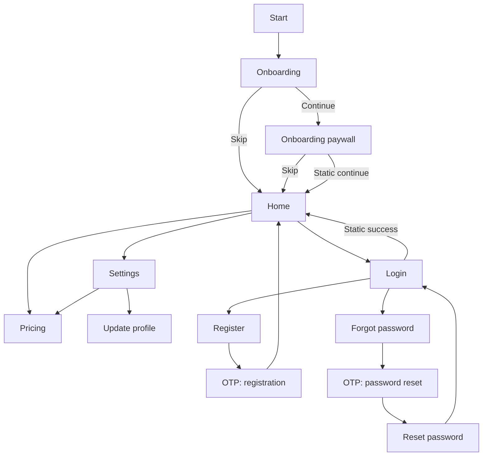

# Initial Static UI Screen Plan

**Status:** Proposed implementation plan

**Scope:** Static, navigable screens used to exercise the starter architecture

**Baseline date:** 21 July 2026

**Targets:** Phone, tablet, resizable desktop, and optionally web

This document is a companion to [initial.md](initial.md). The architecture plan remains the source of truth for dependency direction, environments, package boundaries, and adaptive layout policy.

---

## 1. Purpose

Build a coherent set of static screens before connecting authentication, billing, profile, or product backends.

The screens provide enough realistic UI to evaluate:

- Feature-first folder boundaries.
- Compact, medium, and expanded layouts.
- Touch, mouse, and keyboard behavior.
- ForUI component coverage and missing design tokens.
- ExUI and Dartx usage discipline.
- Simple Animations and reduced-motion behavior.
- `flutter_form_builder` integration without falling back to Material-styled fields.
- Shared form abstractions based on repeated usage rather than prediction.
- English, Arabic, and Simplified Chinese localization.
- RTL, text scaling, focus traversal, validation, and error presentation.
- Screen-level golden tests and a development UI gallery.

The output is a reusable visual and structural baseline, not a production authentication or subscription system.

---

## 2. Included screens

```text
Onboarding
Onboarding paywall with Skip
Home
Settings
Login
Register
Forgot password
OTP verification
Reset password
Update profile
Pricing
Development screen gallery
```

Settings continues to include appearance and language controls from the architecture baseline.

### 2.1 Explicit non-goals

This phase does not implement:

- A real authentication provider or session.
- Social login.
- Network requests or a fake API layer.
- Email or SMS delivery.
- Real OTP verification.
- Password reset tokens.
- In-app purchases, checkout, receipt restoration, or subscription status.
- Avatar upload or file permissions.
- Remote pricing or feature flags.
- Persistent onboarding completion.
- Route guards that pretend a user is authenticated.

Static form submission may validate, show deterministic UI feedback, and navigate to the next demo screen. It must not introduce repositories or services with no real external behavior.

---

## 3. What this phase should teach us

At the end of the static build, review these questions:

1. Which layout patterns are actually repeated across screen families?
2. Which widgets are genuinely shared versus merely similar?
3. Does the app shell remain stable while the window resizes?
4. Are ForUI's touch and desktop variants sufficient for every screen?
5. Which form behavior belongs in shared adapters, and which belongs to the feature?
6. Can every validation and error state be localized cleanly?
7. Do Arabic RTL and maximum text scale expose assumptions in spacing or navigation?
8. Are keyboard, hover, focus, and submit behaviors good enough for desktop?
9. Is any ExUI or Dartx extension hiding important behavior?
10. Does custom motion improve comprehension and still work with animations disabled?

Record the answers before adding backend integrations.

---

## 4. Route map

### 4.1 Routes

| Route | Screen | Notes |
| --- | --- | --- |
| `/onboarding` | Onboarding | Three static introduction pages. |
| `/onboarding/paywall` | Onboarding paywall | Uses pricing-feature content and always exposes Skip. |
| `/` | Home | Main shell destination. |
| `/settings` | Settings overview | Compact list or expanded two-pane settings. |
| `/settings/appearance` | Appearance settings | Theme, accent, text scale, and motion preview. |
| `/settings/language` | Language settings | System, English, Arabic, and Chinese. |
| `/auth/login` | Login | Entry to the static authentication flow. |
| `/auth/register` | Register | Leads to registration OTP. |
| `/auth/forgot-password` | Forgot password | Leads to reset OTP. |
| `/auth/otp` | OTP | Purpose supplied by a typed route/query value. |
| `/auth/reset-password` | Reset password | Leads back to login after static success. |
| `/profile/edit` | Update profile | Static account details form. |
| `/pricing` | Pricing | Full plan comparison outside onboarding. |
| `/dev/screens` | Screen gallery | Development builds only. |

### 4.2 Navigation flow



### 4.3 Route rules

- Routes are named and centralized in `app_routes.dart`.
- The OTP purpose is a typed value such as `registration` or `passwordReset`, not an arbitrary string spread through widgets.
- Static screens remain directly addressable for development and golden tests.
- `/dev/screens` is absent from the production route table.
- Static flows do not introduce fake authentication redirects.
- Back navigation must behave naturally on Android, iOS, and desktop.

---

## 5. Screen inventory

| Screen | Primary content | Required static states |
| --- | --- | --- |
| Onboarding | Illustration/visual, title, body, progress, next/skip | First, middle, final page; compact and expanded |
| Paywall | Benefits, billing choice, plan CTA, restore/legal placeholders, Skip | Monthly, annual, selected, disabled/reduced motion |
| Home | Greeting, quick actions, status cards, recent activity placeholder | Default, empty recent activity, wide/narrow |
| Settings | Section navigation and detail content | Compact list, medium, expanded two-pane |
| Login | Email, password, remember option, forgot/register links | Idle, invalid, submitting, global failure, success |
| Register | Name, email, password, confirmation, terms | Idle, invalid, submitting, field failure, success |
| Forgot password | Email and instructions | Idle, invalid, submitting, success |
| OTP | Six-digit code, resend, destination context | Empty, partial, complete, invalid, expired, submitting |
| Reset password | New password and confirmation | Idle, weak/mismatch, submitting, success |
| Update profile | Avatar placeholder, display name, username, read-only email, bio | Default, dirty, invalid, saving, success |
| Pricing | Plan cards, billing choice, comparison, FAQ/legal placeholders | Compact stack, medium grid, expanded grid |

Every state is deterministic and selectable in tests or the development screen gallery.

---

## 6. Screen specifications

### 6.1 Onboarding

Use three concise pages:

1. A primary value proposition.
2. A cross-device/adaptive experience explanation.
3. A privacy/control or personalization explanation.

Required elements:

- Brand mark or neutral placeholder visual.
- Localized title and body.
- Page progress indicator.
- Back and Continue controls where applicable.
- Skip control that goes directly to Home.
- Final Continue action that opens the onboarding paywall.

Layout behavior:

- Compact: vertical pager with controls pinned safely below the content.
- Medium: centered panel with a larger visual region.
- Expanded: split layout with visual/brand content on one side and copy/actions on the other.

Use a local `PageController`; onboarding page index is ephemeral presentation state and does not need Riverpod.

### 6.2 Onboarding paywall

The paywall is part of the pricing feature even though it appears in the onboarding route flow. This keeps plan data, billing selection, pricing cards, and comparison behavior together.

Required elements:

- Clear Skip action visible without scrolling.
- Localized headline and benefit list.
- Monthly/annual billing selector.
- One highlighted recommended plan.
- Primary static CTA.
- Restore-purchase placeholder.
- Terms and privacy links as non-functional placeholders.
- Honest note that purchasing is not connected in the static phase.

The static CTA may show a success toast and continue to Home. It must not imply that a purchase occurred.

### 6.3 Home

The Home screen exists to exercise the application shell rather than define a product domain prematurely.

Use neutral modules:

- Greeting and compact status summary.
- Quick actions linking to Profile, Pricing, and Settings.
- A small feature/status card grid.
- A recent activity or getting-started section with an empty variant.

Layout behavior:

- Compact: single-column scroll with bottom navigation.
- Medium: navigation rail/narrow sidebar and a two-column card grid.
- Expanded: persistent sidebar, constrained header, and a wider dashboard grid.

Do not introduce repositories for placeholder Home content. Pass immutable view data directly to the page/content widget.

### 6.4 Settings

Initial sections:

```text
Appearance
Language
Account
Subscription
Privacy and About
```

Behavior:

- Appearance controls update the existing theme, accent, text-scale, and motion preview state.
- Language changes between system, English, Arabic, and Simplified Chinese.
- Account links to Update Profile and Login.
- Subscription links to Pricing.
- Privacy/About contains static explanatory copy and build information.

Layout behavior:

- Compact: section list navigates to full-screen detail routes.
- Medium: section list plus a flexible detail area when space permits.
- Expanded: persistent settings navigation and constrained detail panel.

Use the same settings state and controller for every layout.

### 6.5 Login

Fields:

```text
email
password
remember_me
```

Actions:

- Submit.
- Forgot password.
- Register.
- Password visibility toggle.

Static submission validates the form and navigates to Home. The screen gallery can force submitting and global-error variants without introducing a fake authentication service.

### 6.6 Register

Fields:

```text
display_name
email
password
confirm_password
accept_terms
```

Actions:

- Create account.
- Return to Login.
- Show password requirements.

Successful static submission navigates to OTP with purpose `registration`.

### 6.7 Forgot password

Fields:

```text
email
```

Include concise localized instructions and a Return to Login action. Successful static submission navigates to OTP with purpose `passwordReset`.

Do not reveal whether an account exists in production-oriented copy. Even in a static prototype, use neutral confirmation wording.

### 6.8 OTP verification

Use ForUI's `FOtpField` as the visual control and adapt it to Form Builder only if Form Builder ownership provides a measurable benefit.

Requirements:

- Six numeric digits by default.
- Paste support.
- Natural forward typing and backward deletion.
- Keyboard submission when complete.
- Resend action and static countdown label.
- Invalid and expired-code variants.
- Purpose-specific title, body, and destination.
- Code input remains logically LTR inside an Arabic screen.

Successful registration OTP navigates to Home. Successful password-reset OTP navigates to Reset Password.

### 6.9 Reset password

Fields:

```text
new_password
confirm_password
```

Show localized password requirements and mismatch feedback. Static success returns to Login with a success message.

### 6.10 Update profile

Fields and content:

```text
avatar placeholder
display_name
username
email       # read-only in this phase
bio         # optional
```

The avatar action is a visual placeholder and does not request file or camera permission.

Static saving validates, shows deterministic progress/success UI, and retains the edited values while the page remains mounted.

### 6.11 Pricing

Use the same feature-owned plan models and plan-selection widgets as the onboarding paywall.

Initial neutral plan set:

```text
Basic
Pro      # highlighted
Team
```

Required content:

- Monthly/annual billing selection.
- Localized, locale-formatted prices.
- Plan benefits.
- Current/recommended visual treatment.
- Comparison section.
- Small FAQ and legal placeholders.
- Static CTA that clearly does not complete a purchase.

Layout behavior:

- Compact: vertically stacked plan cards.
- Medium: two-column wrapping grid.
- Expanded: three-column grid inside a maximum-width container.

---

## 7. Adaptive layout contract

### 7.1 Canonical layout classes

Use the architecture plan's `AppLayoutClass` and ForUI breakpoint tokens:

| Layout class | Initial range | Canonical token |
| --- | --- | --- |
| Compact | `< 640` logical pixels | `context.theme.breakpoints.sm` |
| Medium | `640..<1024` | Between `sm` and `lg` |
| Expanded | `>= 1024` | `context.theme.breakpoints.lg` |

Feature code asks for an `AppLayoutClass`; it does not repeat breakpoint numbers.

### 7.2 Screen-family layouts

| Family | Compact | Medium | Expanded |
| --- | --- | --- | --- |
| Onboarding | Vertical pager | Centered content panel | Split visual/content |
| Auth | Full-width padded form | Centered form card | Split brand/form shell |
| Home | One column | Rail + two-column content | Sidebar + dashboard grid |
| Settings | List then detail route | Optional two-pane | Persistent two-pane |
| Pricing | Stacked cards | Wrapping two-column grid | Three-column comparison |
| Profile | Full-width form | Centered form | Form plus profile preview |

Branch at the screen-family boundary. Avoid checking width inside every field or button.

### 7.3 Initial content-width tokens

Start with tokens rather than per-screen magic numbers:

```text
formContentMaxWidth:      480
readingContentMaxWidth:   720
wideContentMaxWidth:     1200
```

These values are hypotheses. Adjust them after reviewing screenshots at all target widths and maximum text scale.

### 7.4 Resizing behavior

- Resizing does not reset a form, pager, billing selection, or navigation state.
- Layout changes do not recreate `GlobalKey<FormBuilderState>` instances.
- Avoid animated full-page reflow while the desktop window is actively resizing.
- Scroll position is retained when a screen changes between one- and two-pane layouts where practical.
- A narrow desktop window uses compact or medium layout while retaining mouse and keyboard behavior.

### 7.5 Interaction policy

Layout class and input mode remain separate:

- Touch uses larger targets and spacing.
- Pointer-capable environments expose hover and tooltips where helpful.
- Desktop supports visible focus, Tab/Shift+Tab traversal, Enter submission, Escape dismissal, and scroll-wheel behavior.
- Hybrid devices preserve touch targets while enabling keyboard and pointer accelerators.

---

## 8. Development screen gallery

Add a development-only `/dev/screens` route so every screen and important state can be reviewed without replaying the full flow.

Gallery controls:

```text
Screen
UI scenario
Viewport preset
Theme mode
Accent
Locale
Text scale
Touch/desktop density
Animations enabled/disabled
```

Viewport presets:

```text
390 × 844     compact phone
640 × 900     compact/medium boundary
800 × 1000    tablet or medium window
1024 × 768    expanded boundary
1440 × 900    desktop
700 × 700     narrow resized desktop
```

The gallery should:

- Render deterministic view data.
- Allow light/dark and English/Arabic/Chinese comparison.
- Exercise idle, validation, submitting, failure, success, empty, and disabled states.
- Support framed previews using constrained `MediaQuery` data.
- Avoid a new Storybook-style dependency during the initial phase.
- Remain absent from production routing and navigation.

---

## 9. Deterministic static states

Use a small development-only scenario value:

```dart
enum UiScenario {
  idle,
  invalid,
  submitting,
  failure,
  success,
  empty,
  disabled,
}
```

Rules:

- `UiScenario` controls presentation only and must not become product/domain state.
- Widget tests inject scenarios through constructors or Riverpod overrides.
- Do not use `Future.delayed` to create flaky pseudo-network behavior.
- Normal route usage defaults to `idle` and can transition synchronously after local validation.
- Loading controls disable duplicate submission while retaining visible focus behavior.
- Failure scenarios include field-level and form-level examples.

---

## 10. Feature-first source structure

Create only files used by this screen set:

```text
lib/
├── app/
│   ├── routing/
│   │   ├── app_router.dart
│   │   └── app_routes.dart
│   └── shell/
│       ├── app_shell.dart
│       ├── compact_app_shell.dart
│       └── expanded_app_shell.dart
│
├── features/
│   ├── onboarding/
│   │   ├── onboarding_page.dart
│   │   ├── onboarding_slide.dart
│   │   └── onboarding_view_data.dart
│   ├── home/
│   │   ├── home_page.dart
│   │   └── home_view_data.dart
│   ├── auth/
│   │   ├── login_page.dart
│   │   ├── register_page.dart
│   │   ├── forgot_password_page.dart
│   │   ├── otp_page.dart
│   │   ├── reset_password_page.dart
│   │   ├── otp_purpose.dart
│   │   ├── auth_shell.dart              # extract after login/register comparison
│   │   └── widgets/
│   │       └── password_requirements.dart
│   ├── profile/
│   │   ├── update_profile_page.dart
│   │   └── profile_view_data.dart
│   ├── pricing/
│   │   ├── pricing_page.dart
│   │   ├── paywall_page.dart
│   │   ├── plan_view_data.dart
│   │   └── widgets/
│   │       ├── billing_selector.dart
│   │       ├── plan_card.dart
│   │       └── plan_comparison.dart
│   ├── settings/
│   │   ├── settings_page.dart
│   │   ├── settings_controller.dart
│   │   └── layouts/
│   │       ├── settings_compact_layout.dart
│   │       └── settings_expanded_layout.dart
│   └── dev_gallery/
│       ├── screen_gallery_page.dart
│       ├── preview_frame.dart
│       └── ui_scenario.dart
│
└── shared/
    ├── forms/                          # create at the extraction checkpoint
    │   ├── app_form.dart
    │   ├── app_text_form_field.dart
    │   ├── app_password_form_field.dart
    │   ├── app_otp_form_field.dart
    │   ├── app_form_submit_button.dart
    │   └── app_validators.dart
    ├── adaptive/
    │   └── app_layout_class.dart
    ├── motion/
    │   └── app_motion.dart
    └── theme/
        ├── app_spacing.dart
        └── app_sizes.dart
```

This tree shows likely files, not mandatory empty directories.

### 10.1 Ownership rules

- Paywall and Pricing share one pricing feature because they use the same plan data and selection UI.
- Authentication pages share one auth feature because their navigation and validation rules form one workflow.
- Profile remains separate from auth because editing an existing profile is a different capability.
- The development gallery may import public page/content APIs, but production features must never depend on the gallery.
- Feature-specific widgets remain in their feature even when they resemble a widget elsewhere.
- Promote a widget to `shared/` only after at least two features use the same behavior and styling contract.

---

## 11. Component and abstraction strategy

Use three levels:

### 11.1 Design primitives

ForUI and application tokens own:

- Buttons, fields, cards, tiles, dialogs, sheets, and navigation controls.
- Color, typography, radii, spacing, sizes, and motion tokens.
- Touch/desktop density.

Do not wrap every ForUI component with an application class.

### 11.2 Feature patterns

Feature-owned examples:

- `PasswordRequirements` in auth.
- `PlanCard` and `BillingSelector` in pricing.
- Settings section navigation in settings.
- Home status cards in home.

These do not move to `shared/` merely because they are visually reusable.

### 11.3 Shared application patterns

Candidates that may earn extraction:

- A ForUI/FormBuilder field adapter.
- A shared form submit button with loading/error semantics.
- An auth screen shell after Login and Register demonstrate the same layout.
- A constrained content frame used unchanged by multiple feature families.

Extraction criteria:

1. At least two real callers exist.
2. Their behavior and accessibility requirements match.
3. The proposed API removes duplication without adding mode flags for every caller.
4. The abstraction has a name based on responsibility, not appearance alone.
5. Tests can describe the shared contract independently.

If a shared widget accumulates many booleans such as `isLogin`, `isDesktop`, `showBack`, or `useCompactSpacing`, split it back into feature composition.

---

## 12. Form Builder and ForUI integration

This screen set is the concrete trigger for adding `flutter_form_builder`.

### 12.1 Integration boundary

`FormBuilderTextField` is Material-styled. Do not use it in the application UI.

Instead:

- Use `FormBuilder` for form registration, values, dirty state, validation, reset, and programmatic errors.
- Build `AppTextFormField` from `FormBuilderField<String>` plus a ForUI `FTextField`.
- Forward the FormBuilder field value, focus, enabled state, `didChange`, and error text into the ForUI control.
- Build password and OTP adapters by composition, not by copying the entire text adapter.
- Use `FOtpField` for OTP visuals and behavior.
- Keep ordinary `FTextFormField` available for simple non-FormBuilder forms; do not nest one `FormField` inside another FormBuilder field.

### 12.2 Extraction sequence

Do not design all shared form APIs before seeing real usage:

1. Implement Login with a local, minimal ForUI/FormBuilder adapter.
2. Implement Register and note actual differences.
3. Extract only the stable common field contract into `shared/forms/`.
4. Migrate Login and Register to the shared adapter.
5. Implement Forgot Password, Reset Password, OTP, and Update Profile with that contract.
6. Review the API after all forms exist and remove unused configurability.

Temporary duplication during steps 1–2 is acceptable. It must be resolved at the extraction checkpoint before the screen phase is complete.

### 12.3 Typed form boundary

Form Builder exposes a `Map<String, dynamic>`. Raw maps must stop at each form boundary:

```dart
final class LoginFormValue {
  const LoginFormValue({
    required this.email,
    required this.password,
    required this.rememberMe,
  });

  final String email;
  final String password;
  final bool rememberMe;

  factory LoginFormValue.fromForm(Map<String, dynamic> value) =>
      LoginFormValue(
        email: (value['email'] as String).trim(),
        password: value['password'] as String,
        rememberMe: (value['rememberMe'] as bool?) ?? false,
      );
}
```

Rules:

- Field-name constants remain inside the owning form/page file.
- Typed values contain normalized strings and booleans.
- Controllers and future repositories never consume a raw form map.
- Do not introduce a generic reflection-based form schema.
- Do not use Freezed for these small values until model volume justifies it.

### 12.4 Form field matrix

| Field | Screens | Shared behavior |
| --- | --- | --- |
| Email | Login, Register, Forgot | Email keyboard, autofill, trim on submit, localized validation |
| Password | Login, Register, Reset | Obscuring, visibility toggle, password autofill semantics |
| Confirm password | Register, Reset | Cross-field equality validation |
| Display name | Register, Update Profile | Name autofill and length validation |
| Username | Update Profile | Normalization and allowed-character validation |
| Bio | Update Profile | Optional multiline input and character count |
| Checkbox | Login, Register | Remember/terms with different feature semantics |
| OTP | OTP | Numeric input, paste, completion, purpose-specific errors |

Sharing a field adapter does not mean sharing every feature validator or label.

### 12.5 Validation

Create small localized validator functions:

```text
required
email format
minimum password length
password confirmation
terms accepted
six-digit OTP
username format
maximum bio length
```

Rules:

- Validators return Slang-generated localized messages.
- Validation begins on submit and then updates on user interaction.
- The first invalid field receives focus and scrolls into view.
- Cross-field validation reads the current form state without storing a second copy.
- Client validation does not perform API calls.
- Do not add `form_builder_validators` initially; the small localized rule set is clearer and avoids a second localization path.

### 12.6 Submission and errors

Represent form presentation state consistently:

```text
idle
submitting
success
failure
```

During static implementation:

- Submit first calls `saveAndValidate()`.
- Valid typed values trigger deterministic navigation or success feedback.
- Screen-gallery scenarios inject field and global errors.
- Buttons disable duplicate submission.
- Enter submits forms on desktop when focus is in an appropriate field.
- A global error does not erase field values.

When a real backend arrives, add server-to-field error mapping at the feature boundary. Do not invent a network error hierarchy in this static phase.

---

## 13. Internationalization plan

Add translation keys before or with each screen. No user-facing string is hardcoded in widgets or fixtures.

Suggested namespaces:

```text
common.*
onboarding.*
pricing.*
home.*
settings.*
auth.login.*
auth.register.*
auth.forgotPassword.*
auth.otp.*
auth.resetPassword.*
profile.update.*
validation.*
devGallery.*
```

Rules:

- Use `common.*` only for truly identical meanings such as Back, Continue, Save, Cancel, and Retry.
- Do not concatenate translated fragments.
- Use interpolation for email addresses, resend countdowns, plan periods, and profile names.
- Use pluralization for days, attempts, or other counts.
- Format prices through `intl` with locale and currency code; do not store `"$9.99"` as translated copy.
- Plan IDs remain stable non-localized values; plan display names and benefits are translated.
- Validation messages include field context where needed.
- Directional padding, alignment, icons, and row order are reviewed in Arabic.
- OTP digits remain LTR while the surrounding page remains RTL.
- Chinese layouts are reviewed for line height and compact labels.
- English copy should be realistic enough to expose wrapping rather than intentionally short placeholder text.

For each screen, review:

```text
English at default and maximum text scale
Arabic RTL at default and maximum text scale
Simplified Chinese at default text scale
```

---

## 14. Motion plan

Use motion to clarify navigation, state changes, and selection—not to decorate every screen.

Candidate uses:

- Onboarding page-content transition.
- Billing selector and selected-plan emphasis.
- Appearance preview when theme/accent changes.
- Form-level success or error feedback.
- Compact/expanded content entrance after navigation, not during active resize.

Rules:

- Flutter implicit animation widgets remain the first choice for one-property transitions.
- Simple Animations is used for coordinated or staggered properties.
- Shared duration and curve tokens come from `AppMotion`.
- `MediaQuery.disableAnimationsOf(context)` produces an immediate or reduced transition.
- Focus, validation, and navigation never wait for decorative animation.
- Golden tests settle animations explicitly.
- Looping animations are not required for this screen set.

---

## 15. Accessibility and input requirements

Every screen must support:

- Semantic labels for controls whose visible text is insufficient.
- A logical reading and focus order in LTR and RTL.
- Visible keyboard focus.
- Tab and Shift+Tab traversal.
- Enter submission for forms.
- Escape dismissal for dialogs/sheets.
- Accessible password visibility labels.
- OTP announcements that do not read an unusable sequence of unlabeled boxes.
- Minimum touch targets from the active ForUI touch theme.
- Pointer hover without making hover required.
- Text scaling without clipping or inaccessible scroll regions.
- Sufficient contrast in light, dark, selected, disabled, success, warning, and error states.
- No essential meaning communicated only by color or animation.

Do not disable text scaling globally to preserve a layout.

---

## 16. Testing and visual review

### 16.1 Unit tests

Cover:

- Route parsing for `OtpPurpose`.
- Typed form-map conversion.
- Localized validators.
- Cross-field password confirmation.
- Pricing currency/period formatting.
- Layout-class selection using ForUI breakpoint values.

### 16.2 Widget tests

For every form:

- Required validation.
- Valid input.
- Invalid input.
- Focus-first-error behavior.
- Keyboard submission.
- Loading/disabled state.
- Field and global error presentation.
- Values retained after failure.

For navigation:

- Onboarding Skip reaches Home.
- Paywall Skip reaches Home.
- Register reaches registration OTP.
- Forgot Password reaches reset OTP.
- OTP destinations are purpose-correct.
- Reset Password returns to Login.

For responsive behavior:

- Compact, medium, and expanded shell selection.
- State retained across live resize.
- Pricing cards change layout without overflow.
- Settings changes between list/detail and two-pane layout.
- Auth fields preserve values across layout change.

### 16.3 Golden matrix

Use pairwise coverage rather than every possible combination:

| Screen | Viewport | Locale/theme/state |
| --- | --- | --- |
| Onboarding | 390×844 | English, light, first page |
| Paywall | 390×844 | Arabic, dark, annual selected |
| Home | 1440×900 | English, dark, default |
| Settings | 800×1000 | Chinese, light, language detail |
| Login | 390×844 | English, dark, validation errors |
| Login | 1440×900 | Arabic, light, focused |
| Register | 800×1000 | Chinese, light, default |
| OTP | 390×844 | Arabic, dark, invalid |
| Reset password | 700×700 | English, maximum text scale |
| Update profile | 1440×900 | English, light, dirty form |
| Pricing | 1440×900 | English, dark, annual selected |

Add targeted goldens when a regression has escaped this matrix; do not multiply snapshots without a reason.

### 16.4 Manual review checklist

Review on at least:

- One small phone.
- One large phone or foldable-sized emulator.
- One tablet size.
- A resizable macOS or Windows window.
- Keyboard-only navigation.
- Mouse/trackpad navigation.
- Arabic RTL.
- Maximum application and system text scale.
- Animations disabled.

Capture review notes in the PR or an adjacent follow-up document.

---

## 17. Implementation sequence

### Phase 1 — Routes, fixtures, and gallery

- Add route names and static navigation flow.
- Add translation namespaces and initial English/Arabic/Chinese copy.
- Create immutable screen view data without repositories.
- Create `/dev/screens` with viewport, locale, theme, scale, density, motion, and scenario controls.

### Phase 2 — Form integration spike

- Add `flutter_form_builder` in the same change as the first form.
- Build Login with a local ForUI/FormBuilder adapter.
- Build Register and compare requirements.
- Test validation, keyboard submission, error focus, and RTL.
- Extract the minimal stable shared form adapter.

### Phase 3 — Remaining auth and profile forms

- Build Forgot Password.
- Build OTP with `FOtpField`.
- Build Reset Password.
- Build Update Profile.
- Add typed form values and localized validators.
- Review the shared form API and remove unused options.

### Phase 4 — Main static screens

- Build Onboarding and its adaptive layouts.
- Build Paywall and Pricing inside the pricing feature.
- Build Home shell content.
- Complete compact and expanded Settings layouts.

### Phase 5 — Adaptive, motion, and accessibility hardening

- Verify ForUI `sm`/`lg` breakpoint transitions.
- Verify touch, pointer, hybrid, and keyboard behavior.
- Add only the approved purposeful animations.
- Implement reduced-motion behavior.
- Test text scaling, focus order, semantics, contrast, and RTL.

### Phase 6 — Refactor and lock the baseline

- Review every shared abstraction against its real callers.
- Move feature-specific widgets back out of `shared/` where appropriate.
- Remove duplicated adapters resolved by the form extraction.
- Run format, analysis, unit, widget, and golden tests.
- Record discovered design-system gaps and architecture changes.
- Update [initial.md](initial.md) if a new rule has become part of the baseline.

---

## 18. Deliverables

This phase produces:

- Navigable static routes for every listed screen.
- Compact, medium, and expanded layouts.
- A development-only screen gallery.
- English, Arabic, and Simplified Chinese copy.
- ForUI-compatible Form Builder adapters proven across the form set.
- Typed form submission values.
- Localized validators and deterministic error states.
- Purposeful reduced-motion-aware animations.
- Responsive, accessibility, widget, and golden tests.
- A short follow-up report listing abstractions kept, changed, or rejected.

---

## 19. Definition of done

- [ ] All listed screens are reachable without backend services.
- [ ] Onboarding and paywall both provide working Skip paths to Home.
- [ ] Auth and password-reset demo flows navigate to the correct static destinations.
- [ ] Pricing and onboarding paywall share pricing-feature plan components without cross-feature internal imports.
- [ ] Login and Register were implemented before finalizing the shared form API.
- [ ] Form Builder manages the form state while ForUI owns field appearance and interaction.
- [ ] No Material `FormBuilderTextField` appears in application UI.
- [ ] Raw form maps are converted to typed feature values at submission.
- [ ] Validation and form errors are localized.
- [ ] Compact, medium, and expanded layouts use one canonical breakpoint source.
- [ ] Forms and navigation state survive desktop window resizing.
- [ ] Touch, mouse, and keyboard behavior is verified.
- [ ] English, Arabic RTL, and Simplified Chinese render without overflow.
- [ ] Maximum text scale remains usable.
- [ ] Custom motion respects disabled-animation preferences.
- [ ] The development gallery can render all important UI scenarios and viewport presets.
- [ ] Production routing contains no screen-gallery route.
- [ ] No fake API, auth, purchase, OTP, or upload service was introduced.
- [ ] Shared widgets have at least two matching real callers.
- [ ] `dart format`, `flutter analyze`, and relevant tests pass.

---

## 20. Deferred product decisions

Use these static defaults for now, but revisit them before backend work:

| Decision | Static default |
| --- | --- |
| Brand visuals and final copy | Neutral placeholders with realistic localized length |
| Onboarding page count | Three |
| OTP length | Six numeric digits |
| OTP delivery channel | Generic “sent to your contact” copy |
| Plans | Basic, Pro, Team |
| Billing periods | Monthly and annual |
| Currency | Configurable view data; use one demo currency per fixture |
| Social authentication | Excluded |
| Profile fields | Display name, username, read-only email, optional bio |
| Legal destinations | Static placeholders |
| Purchase behavior | Static feedback only |

These defaults must not harden into domain or backend contracts accidentally.

---

## 21. Primary references

- Architecture baseline: [initial.md](initial.md)
- ForUI responsive concepts: https://forui.dev/docs/concepts/responsive
- ForUI text form field: https://forui.dev/docs/widgets/form/text-form-field
- ForUI OTP field: https://forui.dev/docs/form/otp-field
- Flutter Form Builder: https://pub.dev/packages/flutter_form_builder
- Flutter adaptive layout approach: https://docs.flutter.dev/ui/adaptive-responsive/general
- Flutter adaptive best practices: https://docs.flutter.dev/ui/adaptive-responsive/best-practices
- Flutter accessibility: https://docs.flutter.dev/ui/accessibility
