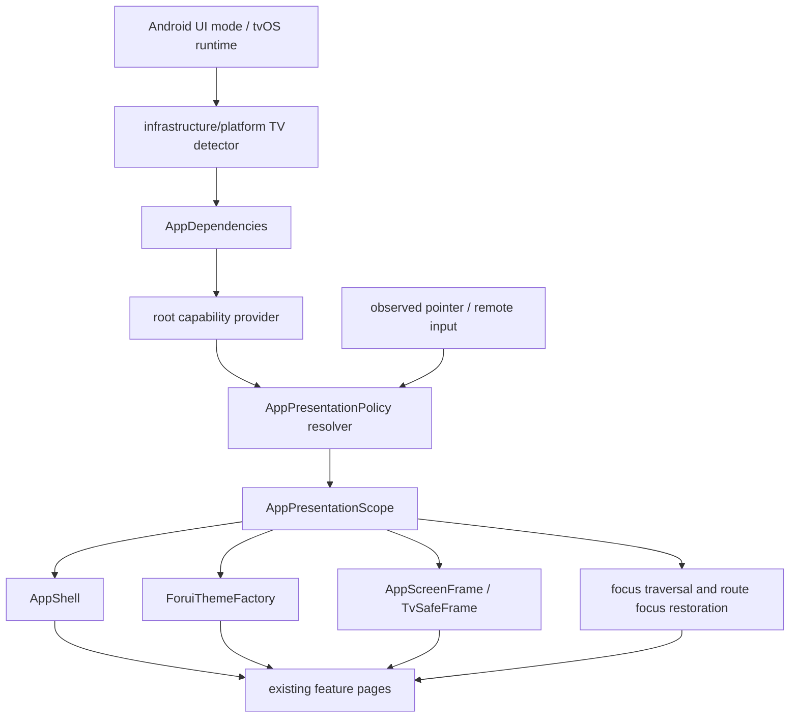

# tvOS and Android TV Support Plan

**Status:** Proposed implementation specification

**Prepared:** 27 July 2026

**Applies to:** Flutter 3.44.x / Dart 3.12.x starter baseline

**Targets:** Android TV and Google TV, tvOS 13+, existing phone/tablet/desktop targets

**Primary objective:** Add a high-quality ten-foot UI and remote-control interaction model without
forking the application, duplicating feature pages, or introducing platform checks throughout the
widget tree.

**Related architecture:** [architecture.md](../architecture.md),
[initial.md](initial.md), [initial_ui.md](initial_ui.md), and
[feature_contracts.md](feature_contracts.md)

---

## 1. Executive decision

The application will support television devices through shared presentation and input policies,
not through separate Android TV and tvOS feature implementations.

Most feature state, typed values, callbacks, localization, routing, validation, persistence, and
ForUI controls remain unchanged. TV-specific behavior is concentrated in five boundaries:

1. **Platform capability detection** at startup.
2. **A ten-foot presentation policy** composed above the application widget tree.
3. **A remote interaction policy** integrated with Flutter's standard focus, shortcuts, and
   actions systems.
4. **Central TV theme and layout tokens** consumed automatically by shells and shared frames.
5. **Platform projects and native plugin adapters** under `android/`, `tvos/`, and
   `lib/infrastructure/`.

The implementation must not:

- Create `features_tv/`, duplicate every page, or maintain parallel Android TV and tvOS widget
  trees.
- Add `Platform.isAndroid`, `TvOSInfo.isTvOS`, `MediaQuery.size`, or TV package imports throughout
  feature pages.
- Wrap every ForUI control in an application-specific pass-through widget.
- Treat a large desktop window as a television merely because it is wide.
- Treat a television as a touch device merely because its operating system reports Android or
  iOS-like platform semantics.
- Introduce a generic device manager, global service locator, or a second navigation system.

Android TV is the lower-risk platform because the repository already has an Android target. tvOS
is feasible, but it uses the independent
[`flutter-tvos`](https://fluttertv.dev/) engine and CLI rather than the stock Flutter SDK. The
[`flutter_tvos`](https://pub.dev/packages/flutter_tvos) package supplies detection and Siri Remote
integration; the package alone does not create or build a tvOS application.

---

## 2. Goals and success criteria

### 2.1 Product goals

- Every production screen is understandable and operable from a D-pad, Siri Remote, compatible
  game controller, or Bluetooth keyboard.
- The UI is readable at approximately three metres / ten feet on 1080p and 4K displays.
- Focus is always visible and movement is predictable in English, Arabic, and Simplified Chinese.
- Back/Menu unwinds the existing `go_router` stack correctly, including nested password recovery,
  tab branches, dialogs, dirty-form confirmation, and direct-entry routes.
- Phone, tablet, desktop, and optional web behavior remains unchanged.
- Adding a future feature normally requires using existing ForUI controls and shared screen
  primitives, not hand-writing TV padding and focus code.

### 2.2 Architecture goals

- Preserve feature-first ownership and all public feature contracts.
- Keep width-derived `AppLayoutClass` separate from viewing-distance and input policies.
- Resolve platform detection once and expose an immutable, injectable result.
- Apply TV scale, safe content bounds, background, motion, and focus styling centrally.
- Use Flutter `Focus`, `FocusTraversalGroup`, `Shortcuts`, `Actions`, and standard activation
  intents rather than a custom key-dispatch framework.
- Add abstractions only where TV creates a real second implementation or a repeated caller.
- Keep platform plugins behind infrastructure adapters.
- Make TV states reproducible in tests and the development gallery without a TV device.

### 2.3 Definition of done

TV support is not complete merely because the application launches. Completion requires:

- Android TV and tvOS builds launch from their platform home screens.
- All actionable controls are reachable and activatable without touch or pointer input.
- Focus never disappears behind a viewport edge, overlay, inactive shell branch, or software
  keyboard.
- No screen depends on hover, swipe-only gestures, or an invisible focus state.
- The maximum supported application text scale remains operable.
- RTL directional traversal and directional icons are correct.
- Real-device smoke tests pass on at least one Android TV device and one Apple TV device.
- Platform-native Back/Menu behavior and application navigation tests agree.
- Existing non-TV format, analysis, test, golden, and smoke gates remain green.

---

## 3. Scope

### 3.1 Included

- Android TV / Google TV application discovery and launch configuration.
- A dedicated tvOS platform project produced by the `flutter-tvos` toolchain.
- Siri Remote, D-pad, game-controller, and keyboard focus navigation.
- TV shell, navigation chrome, safe content frame, design tokens, and focused states.
- Home, Pricing, Settings, authentication, password recovery, OTP, Profile, Onboarding, Paywall,
  startup failure, route error, and system overlay surfaces.
- TV-compatible settings persistence and build information.
- Gallery previews, widget tests, integration smoke tests, and platform release checklists.
- Light, dark, high-contrast, reduced-motion, localization, and accessibility behavior.

### 3.2 Deferred until a real product caller exists

- Video playback, transport controls, timelines, subtitles, audio focus, DRM, and picture-in-picture.
- Top Shelf, Watch Next, content recommendations, universal search, and deep-link catalogue
  integration.
- In-app purchases, StoreKit, Google Play Billing, subscription entitlement, and restore.
- Account linking by QR code or second-screen device.
- Voice search, microphone permission, speech recognition, and Siri intents.
- Multi-user Apple TV profiles.
- Game-specific controller mappings.
- Background downloads and offline media.

These capabilities are named so the architecture does not accidentally block them. They must not
produce empty repositories, services, or platform channels before a product feature needs them.

### 3.3 Non-goals

- Pixel-identical Android TV and tvOS chrome.
- Replacing ForUI with a TV-specific component library.
- Making every desktop shortcut available on a remote.
- Locking the ordinary Android mobile application to landscape.
- Assuming overscan is present on every modern TV.
- Supporting touch-only television hardware.
- Claiming store readiness before product identifiers, brand assets, signing, legal content, and
  real backend behavior exist.

---

## 4. Existing baseline and impact

### 4.1 Reusable without feature API changes

The following existing contracts remain authoritative:

- `HomePage`, `PricingPage`, `PaywallPage`, `UpdateProfilePage`, and all auth pages continue to
  receive typed values and callbacks from the router.
- `SettingsController` remains the only settings mutation boundary.
- `StatefulShellRoute` continues to own the Home, Pricing, and Settings branch stacks.
- Full-screen flows remain top-level routes and keep their current push-versus-go semantics.
- Slang remains the only localization system.
- ForUI remains the only application component and theme system.
- `AppKeyboardHost` remains the only focus-independent application shortcut listener.
- Feature fixtures and the gallery remain the deterministic presentation test seam.

No public constructor in [feature_contracts.md](feature_contracts.md) needs a TV parameter.

### 4.2 Gaps to close

The current application:

- Resolves interaction as `touch`, `precisionPointer`, or `hybrid`; it has no remote policy.
- Derives layout from width correctly, but its maximum responsive type scale is designed for
  near-field desktop use.
- Relies mostly on default focus traversal and has no route-level focus restoration contract.
- Uses standard ForUI focus outlines, but those outlines have not been reviewed from ten feet or
  across every selected/disabled/error combination.
- Has no TV safe-content margin or TV-specific maximum content width.
- Has no Android Leanback launcher, TV feature declaration, TV banner, or touchscreen-optional
  declaration.
- Has no `tvos/` target and has not audited native dependencies against federated tvOS plugins.

### 4.3 Core architectural rule

`AppLayoutClass` remains width-only:

```text
available width -> compact | medium | expanded
```

TV adds two orthogonal signals:

```text
viewing environment -> nearField | tenFoot
primary interaction -> touch | precisionPointer | hybrid | remote
```

This means:

- A large desktop window is `expanded + nearField + precisionPointer`.
- An Android TV is normally `expanded + tenFoot + remote`.
- A television with a connected mouse may be `expanded + tenFoot + hybridRemote`.
- A narrow gallery preview can intentionally render `compact + tenFoot + remote` to find
  constraint bugs; production televisions are still expected to be landscape and expanded.

Do not add `television` to `AppLayoutClass`.

---

## 5. Proposed architecture

### 5.1 Dependency flow



Platform packages terminate in infrastructure or bootstrap. Feature code consumes application
policy, theme values, and standard Flutter focus behavior.

### 5.2 Platform classification

Add:

```dart
enum AppTvPlatform {
  none,
  androidTv,
  tvOS,
}

enum AppViewingEnvironment {
  nearField,
  tenFoot,
}
```

Extend `PlatformCapabilities` with immutable facts:

```dart
final class PlatformCapabilities {
  const PlatformCapabilities({
    required this.platform,
    required this.isWeb,
    required this.supportsFileSystem,
    required this.tvPlatform,
  });

  final AppTvPlatform tvPlatform;

  bool get isTelevision => tvPlatform != AppTvPlatform.none;
}
```

`AppTvPlatform` is a capability and packaging fact. Feature pages must not branch on it. A
platform-specific branch is permitted only for behavior that actually differs between Android TV
and tvOS, such as remote initialization, native exit policy, store integration, or platform
plugin selection.

### 5.3 Interaction policy

Extend the existing enum rather than creating a competing input model:

```dart
enum AppInteractionPolicy {
  touch,
  precisionPointer,
  hybrid,
  remote,
  hybridRemote,
}
```

Required semantics:

| Policy | Primary navigation | Pointer allowed | Touch density | Hover-only affordances |
| --- | --- | --- | --- | --- |
| `touch` | Touch | No assumption | Yes | Never |
| `precisionPointer` | Pointer/keyboard | Yes | No | Allowed as enhancement |
| `hybrid` | Touch and pointer | Yes | Yes | Never required |
| `remote` | Directional focus | No assumption | TV tokens | Never |
| `hybridRemote` | Directional focus and pointer | Yes | TV tokens | Never required |

Remote observation is monotonic for the application session, like current pointer observations.
Connecting a mouse must not downgrade a television to desktop density. Disconnecting a controller
must not rebuild the entire application or clear focused state.

### 5.4 Presentation policy

Add a small immutable value that composes, but does not replace, existing layout policy:

```dart
@immutable
final class AppPresentationPolicy {
  const AppPresentationPolicy({
    required this.viewingEnvironment,
    required this.interactionPolicy,
  });

  final AppViewingEnvironment viewingEnvironment;
  final AppInteractionPolicy interactionPolicy;

  bool get isTenFoot => viewingEnvironment == AppViewingEnvironment.tenFoot;
  bool get usesDirectionalFocus =>
      interactionPolicy == AppInteractionPolicy.remote ||
      interactionPolicy == AppInteractionPolicy.hybridRemote;
}
```

Expose it through an `AppPresentationScope` below `MaterialApp.router` and above `FTheme`.
Provide:

- `AppPresentationPolicy.of(context)` for layout/theme consumers.
- A Riverpod provider for root composition and diagnostics.
- An explicit override provider for tests and gallery previews.

This scope is justified because shell, theme, shared frames, overlays, and tests all need the same
stable policy. Do not pass the policy through every page constructor.

### 5.5 Detection adapter

Introduce one infrastructure port only because production and tests require different
implementations:

```text
lib/infrastructure/platform/tv_platform_detector.dart
lib/infrastructure/platform/native_tv_platform_detector.dart
```

Suggested contract:

```dart
abstract interface class TvPlatformDetector {
  Future<AppTvPlatform> detect();
  Future<void> initializeRemoteSupport();
}
```

Production behavior:

- tvOS: use `TvOSInfo.isTvOS`; initialize `TvRemoteController` once.
- Android: query native `UiModeManager.currentModeType == Configuration.UI_MODE_TYPE_TELEVISION`
  through a narrow platform channel or a proven maintained package.
- Other platforms and web: return `none`; initialization is a no-op.

Test behavior:

- `AppDependencies.inMemory` accepts `AppTvPlatform`, defaulting to `none`.
- Tests never mock a method channel when a dependency override expresses the scenario.

Detection runs during `AppDependencies.production`. Failures are logged through `AppLogger` and
fall back to `none`; platform detection must not prevent startup. The redacted diagnostic summary
may include `tv=androidTv|tvOS|none`, but never remote identifiers or account data.

### 5.6 Root composition

Root changes are intentionally narrow:

1. `bootstrap.dart` ensures bindings and creates production dependencies.
2. `AppDependencies.production` resolves platform capabilities and initializes remote support.
3. `App` overrides the immutable capability provider.
4. `_AppView` resolves presentation policy and passes it to the theme and scope.
5. `AppInputObserver` observes pointer/controller categories without owning navigation.
6. `AppKeyboardHost` continues to process only registered global shortcuts and modifier previews.

Siri Remote and D-pad arrow events must not be consumed by `AppKeyboardHost`. They flow into
Flutter's normal focus system. Remote Back/Menu is handled through navigation actions or Flutter's
platform `popRoute`, not registered as a desktop keyboard chord.

---

## 6. UI abstraction strategy

### 6.1 Centralize policy, not every widget

The lowest-maintenance solution is not an `AppButton`, `AppTile`, and `AppSlider` wrapper around
every ForUI control. Those wrappers would duplicate package APIs and create ongoing manual work.

Instead:

- Configure focused, pressed, disabled, selected, error, and size behavior in
  `ForuiThemeFactory`.
- Apply safe content bounds once in the shell or shared route frame.
- Use standard ForUI controls so activation and semantics continue to work.
- Add a shared focusable wrapper only for custom interactive surfaces that are not already ForUI
  controls.
- Add explicit traversal groups only where spatial layout makes default reading order ambiguous.
- Add a feature-owned layout seam only when that feature genuinely needs a different ten-foot
  composition.

### 6.2 Central TV tokens

Add a hand-written application token extension, not changes to generated ForUI files:

```text
lib/shared/theme/app_presentation_tokens.dart
```

The resolved token set should cover:

- Page safe-content fraction and minimum/maximum insets.
- Maximum readable content width.
- Body and display type multipliers.
- Control minimum height and minimum focus target.
- Card padding and inter-card gap.
- Navigation rail/sidebar width.
- Focus outline width, color, spacing, elevation, and optional scale.
- Scroll reveal padding.
- Overlay width and edge margins.
- Motion durations for focus movement.

Initial values must be tuned in gallery and device review, not permanently copied from a platform
sample. Recommended starting policy:

```text
near-field page inset: existing responsive spacing tokens
ten-foot safe frame: max(48 logical px, 5% of each display dimension), bounded
ten-foot body scale: approximately 1.30–1.45 before user/system scale
ten-foot minimum control height: approximately 56–64 logical px
ten-foot focus outline: at least 3 logical px with non-color shape/elevation change
ten-foot readable line length: approximately 45–75 characters
```

The 5% frame is a conservative overscan-safe starting point from Android TV guidance. Apply the
maximum of platform `MediaQuery.padding`, display-feature avoidance, and the TV frame; do not add
them blindly and double-pad content.

### 6.3 Text scaling composition

The final text size remains the composition of:

```text
base ForUI size
× presentation responsive scale
× ten-foot viewing scale
× application fontScale setting
× ambient nonlinear system TextScaler
```

Rules:

- Do not replace or globally clamp the system `TextScaler`.
- Do not bake TV values into generated typography files.
- Keep the user's application font scale setting meaningful on TV.
- Use width constraints and scroll before shrinking required text.
- Verify `1.60x` application scale with the maximum supported system scale.
- If the product later needs a separate TV preference, add it only after user research; do not
  silently persist a different value per platform now.

### 6.4 Shared screen frame

The existing route-transition builder paints opaque route backgrounds. TV additionally needs
consistent content bounds. Introduce or extend one shared route frame:

```dart
class AppScreenFrame extends StatelessWidget {
  const AppScreenFrame({
    required this.child,
    this.scrollController,
    this.maxContentWidth,
    this.applyHorizontalSafeFrame = true,
    this.applyVerticalSafeFrame = true,
  });
}
```

Responsibilities:

- Paint the active theme's hard background.
- Combine system safe area, display features, and ten-foot content frame.
- Constrain readable width.
- Avoid bottom-navigation padding when the TV shell has no bottom navigation.
- Expose standard scroll reveal padding.
- Preserve ordinary mobile/desktop behavior.

It must not:

- Add its own `Scaffold` per feature.
- Infer navigation chrome from route strings.
- own feature headings, actions, or form state.
- Apply nested safe areas that clip tab content.

Tabbed shell screens should receive safe content from the shell/frame exactly once. Full-screen
routes use the same frame outside the tab shell. Tests must explicitly detect doubled insets.

### 6.5 TV shell

`AppShell` keeps its current go-router-agnostic contract. Add a TV presentation selected by
`AppPresentationPolicy`, not by width:

```text
AppShell
├── tenFoot -> TelevisionAppShell
└── nearField
    ├── compact -> CompactAppShell
    ├── medium -> ExpandedAppShell(compact)
    └── expanded -> ExpandedAppShell
```

`TelevisionAppShell`:

- Receives only `selectedIndex`, `onSelectTab`, and `child`.
- Uses a stable leading navigation region appropriate for D-pad movement.
- Uses larger navigation items and visible selected/focused states.
- Keeps navigation and content in separate traversal groups.
- Supports Left/Right directional movement between navigation and content in LTR and the mirrored
  relationship in RTL.
- Does not import `go_router`.
- Does not duplicate branch state or route definitions.
- Restores focus to the selected destination when content returns focus to navigation.
- Avoids bottom navigation because it is difficult to reach consistently with a remote and wastes
  vertical safe area.

The television shell may initially resemble the expanded sidebar, but it must have TV-owned tokens
and focus behavior. Reusing `ExpandedAppShell` through scattered boolean flags is discouraged once
the differences exceed width and padding.

### 6.6 Focus presentation

ForUI's existing `FTappable`-based controls already support focused outlines. Configure their
theme centrally:

- Focus must remain distinguishable when the control is also selected.
- Focus must not rely only on accent color.
- Light and dark backgrounds need equivalent contrast.
- Disabled controls remain unfocusable unless they expose an explanation action.
- Error borders and focus borders must not visually cancel each other.
- A modest scale/elevation effect is allowed but must not clip adjacent cards or cause layout
  reflow.
- Scale should be painted, not laid out, and disabled when reduced motion is requested.
- Focus animation should complete quickly enough for repeated D-pad movement.

Create `AppFocusableSurface` only for custom clickable cards or canvas-like elements that cannot
use a ForUI control:

```dart
class AppFocusableSurface extends StatelessWidget {
  const AppFocusableSurface({
    required this.onActivate,
    required this.builder,
    this.focusNode,
    this.autofocus = false,
  });
}
```

It should be based on `FocusableActionDetector` and standard `ActivateIntent`. It must expose
semantics and use the same focused-state tokens as ForUI. It is not a general layout wrapper.

### 6.7 Low-manual-work contract for future screens

A future feature should become basically TV-compatible by following the ordinary application
architecture. The expected authoring contract is:

```text
Use AppScreenFrame
  -> background, safe content bounds, readable width, and reveal padding are automatic

Use ForUI controls
  -> activation, semantics, minimum TV size, and focused styling are automatic

Use AppShell
  -> television navigation chrome and branch behavior are automatic

Use route callbacks
  -> Back/Menu and stack behavior remain root-owned

Use one primary Scrollable
  -> shared focus reveal behavior can operate automatically
```

Per-screen work should normally be limited to:

- Choosing the initial semantic focus target.
- Declaring a `FocusTraversalGroup` around a genuine grid or nested region.
- Giving dynamic actionable items stable keys.
- Verifying that long content scrolls and that all actions remain reachable.

Per-screen code must not specify:

- TV-only page padding.
- TV-only font sizes or control heights.
- Android TV versus tvOS branches.
- Raw remote key mappings.
- Route-pop logic.
- Custom focused border colors.
- A second screen background.

Add a reusable TV screen contract test harness under `test/hardening/tv/`. Given a gallery case,
the harness should:

1. Force `tenFoot + remote`.
2. Find the declared initial focus target.
3. Walk reachable controls using directional keys with a bounded step count.
4. Assert every enabled semantic action is reachable.
5. Activate safe deterministic controls where the fixture permits it.
6. Assert no focused render box falls outside the resolved safe content rectangle.
7. Repeat in RTL and at maximum text scale for selected canonical cases.

This harness reduces future manual test boilerplate, but it must not guess destructive or
state-changing activation. Each gallery case supplies an allowlist of safe activations or marks
itself traversal-only.

---

## 7. Directional focus system

### 7.1 Rules

Every TV route must define:

- A deterministic initial focus target.
- A predictable directional path between all enabled controls.
- A focus restoration target after returning from a child route or overlay.
- Scroll-to-reveal behavior.
- A boundary policy for the first/last item.
- RTL behavior.

Default Flutter reading-order traversal remains the baseline for simple vertical forms. Add
`FocusTraversalGroup` where:

- A sidebar and content region are siblings.
- Cards form a two-dimensional grid.
- A horizontal selector sits above a vertical list.
- A dialog or sheet must trap focus.
- Visual order differs from source order at responsive breakpoints.

Do not assign numeric `FocusOrder` to every control. Explicit orders are reserved for layouts where
reading order cannot express the visual relationship.

### 7.2 Spatial grids

Home quick actions, foundation cards, recent activity, and pricing cards need spatial traversal:

- Left/Right moves within a visual row.
- Up/Down selects the nearest eligible control in the adjacent row.
- Ragged final rows choose the nearest horizontal centre, not an arbitrary creation order.
- Hidden, disabled, or offstage cards are excluded.
- Resizing or locale changes recompute traversal without losing the currently focused semantic
  item when it still exists.
- LTR and RTL mirror horizontal intent while preserving logical item identity.

Prefer Flutter's directional traversal behavior first. Implement a custom
`FocusTraversalPolicy` only if device tests prove the default spatial policy produces unstable
results for responsive grids.

### 7.3 Route focus restoration

Add a root-owned, router-adjacent focus restoration mechanism rather than storing `FocusNode`s in
Riverpod:

- Each route/shell branch may register a stable semantic focus key.
- Before pushing a child route or opening an overlay, remember the current key.
- On pop, restore the matching mounted node after layout.
- If the node no longer exists, focus the route's default target.
- Switching tabs remembers focus independently per branch.
- Resetting a tab to its initial location resets its remembered child-route focus but may focus
  the tab's primary content target.
- Direct links use the route default because there is no prior target.
- Focus memory is ephemeral and must not be persisted across application restarts.

Focus restoration should be implemented only after tests demonstrate the exact lifecycle. Avoid a
generic global `Map<String, FocusNode>` that owns disposable widget objects.

### 7.4 Scrolling and reveal

When focus moves:

- The target must be fully visible inside the TV safe frame.
- `Scrollable.ensureVisible` uses central reveal padding and reduced-motion behavior.
- Repeated remote key events must not queue long animations.
- A list reaching its edge must not transfer focus to unrelated chrome accidentally.
- Focused content must not hide beneath a pinned header, toast, keyboard, or overscan margin.
- Virtualized lists must preserve stable keys and recreate focus safely when an item scrolls out
  and back in.

For long pages, use one primary scrollable. Nested vertical scrollables require a documented
directional handoff and should otherwise be avoided.

### 7.5 Activation

- Select/Enter invokes Flutter's `ActivateIntent`.
- Space may activate buttons when a physical keyboard follows platform convention.
- Key repeat may move focus but must not repeatedly submit forms, purchase, resend OTP, or trigger
  navigation.
- Destructive and network-like actions ignore repeat events.
- Long-press remote gestures are not assigned app behavior until a product requirement exists.
- Play/Pause and media keys remain unhandled by non-media screens.

---

## 8. Navigation and Back/Menu behavior

### 8.1 Back priority

Back/Menu resolves in this order:

1. Dismiss an open tooltip/popover/menu.
2. Dismiss a modal dialog or sheet, subject to its confirmation contract.
3. Close the software keyboard if the platform reports it as a distinct dismissible layer.
4. Let a dirty form show its existing discard confirmation.
5. Pop the current `go_router` route.
6. If inside a non-initial shell branch route, return to that branch root.
7. At an application root, follow platform policy:
   - Android TV: allow the operating system to leave/finish the application when appropriate.
   - tvOS: do not fake an application exit; let the system handle Menu/Home conventions.

Do not implement Back as `goNamed(login)` or `goNamed(home)`. It must preserve stack semantics.

### 8.2 Existing auth flow

The password-reset flow remains stack-preserving:

```text
Home -> pushed Login -> Forgot -> reset OTP -> Reset Password -> Login
```

After completion unwinds to the original Login, another Back returns to Home because Login was
originally pushed.

A direct Login location has no caller and therefore has no application route to pop. At that root,
Back delegates to platform behavior. This distinction must remain the same on desktop, Android TV,
and tvOS.

### 8.3 Shell branches

- Selecting a different TV navigation destination calls the existing `goBranch`.
- Re-selecting the active destination resets it to its branch initial location, matching the
  current shell contract.
- Inactive branches remain mounted but are excluded from focus, hit testing, semantics, and
  ticking, as they are today.
- Remote focus cannot enter a fading inactive branch during transition.
- Reduced motion switches branches immediately.

### 8.4 Route transitions

- Every route remains opaque throughout transitions.
- TV uses restrained fades or short transforms; avoid mobile edge-swipe metaphors.
- Transition animation must not temporarily expose the previous route through a transparent
  surface.
- Input is debounced or directed to the destination while a transition is committing.
- Reduced motion completes immediately without leaving two focus scopes active.

---

## 9. Controls and overlay edge cases

### 9.1 Buttons, tiles, cards, and navigation items

- All enabled actions are focusable and activate with Select/Enter.
- Non-interactive cards are not focusable merely because they have borders.
- Selected navigation state and focused navigation state are independently visible.
- Card-inside-card presentation should be removed where it obscures focus containment.
- Focus scale cannot collide with an adjacent card or be clipped by a parent `ClipRect`.

### 9.2 Toggles, radio groups, and segmented controls

- Select toggles a switch or checkbox.
- Arrow keys may change a radio/segmented selection only when focus is inside the group and the
  platform convention is clear.
- Changing selection must not unexpectedly move focus.
- Current value and role are announced through semantics.
- A horizontal group mirrors correctly in RTL.

### 9.3 Sliders

Settings font scale is a required special case:

- Select/Enter enters adjustment mode if plain arrow traversal would otherwise leave the slider.
- Left/Right changes the value by one defined step; RTL must follow the control's logical value
  semantics, not blindly reverse application code.
- Up/Down either adjusts according to platform convention or exits/transfers focus consistently;
  choose one behavior and test both platforms.
- Back exits adjustment mode before leaving the page.
- The current percentage is announced after a change without duplicate live-region output.
- Key repeat may adjust continuously but remains bounded and does not overwhelm persistence writes.
- Persistence failure restores the previous value and retains usable focus.

If ForUI's slider already supplies correct keyboard semantics, configure and test it rather than
wrapping it.

### 9.4 Text fields and software keyboard

- Focusing a text field does not automatically open the keyboard unless the platform convention
  expects it; Select should enter editing when required.
- tvOS uses the embedder's native text-field bridge and on-screen keyboard.
- Android TV uses the configured IME; test Gboard-style and vendor keyboard behavior.
- The field, validation error, and primary action remain reachable after keyboard dismissal.
- Next/Previous actions follow logical localized field order.
- Submit from a single-line final field is allowed only by the existing form contract.
- Bio remains multiline; Enter inserts a newline and never submits.
- Passwords and OTP values are never included in diagnostics, focus restoration keys, or state
  restoration.
- Pasting from a paired device/keyboard follows existing validation.
- Autofill may be absent on televisions; forms must not depend on it.

To reduce manual input in a real product, consider QR/device-code sign-in later. It is not part of
this static starter plan.

### 9.5 OTP

- OTP cells expose a coherent group, position, validation state, and current-entry policy.
- Directional navigation must not fight automatic advancement.
- Backspace from an empty cell moves to the previous cell only according to the existing OTP
  control contract.
- Resend is focusable when available and cannot trigger repeatedly from key repeat.
- Expiry updates do not steal focus.
- The software keyboard does not obscure progress or errors.

### 9.6 Dialogs, sheets, menus, and popovers

- Opening an overlay stores the invoker focus target.
- Focus is trapped inside modal surfaces.
- A deterministic safe default receives initial focus; destructive actions should not be the
  default without a compelling reason.
- Back/Menu dismisses the topmost eligible overlay.
- Dismiss restores focus to the invoker or a safe fallback.
- Outside-click dismissal remains available for pointer hybrids but is never required.
- Tooltip content cannot be the only source of necessary information.
- Toasts are not focusable and do not steal focus; important feedback uses semantics.
- Overlays stay inside the ten-foot safe frame and do not anchor off-screen near its edges.

### 9.7 Loading, disabled, and error states

- A loading action retains or intentionally transfers focus; it does not leave focus on a removed
  node.
- Disabled actions are skipped by traversal.
- If all actions become disabled, focus moves to a meaningful recovery or container target.
- Retry preserves the user's route and form draft where safe.
- Startup and route errors expose a deterministic primary recovery action.
- Network loss or platform-service failure does not create a remote focus trap.

---

## 10. Screen adaptation matrix

The default strategy for every screen is shared widgets plus TV tokens. A feature-specific layout
branch is allowed only for the differences listed below.

### 10.1 Home

**Reuse:** View data, headings, action callbacks, status/activity content, empty state.

**TV adaptation:**

- Quick actions become a clear spatial grid with one focusable surface per action.
- Foundation status remains informational unless an item has a real action.
- Recent activity uses flat list/card items with space between borders; avoid nested cards.
- The page default focus is the first enabled quick action.
- Empty activity does not create a dead focus region.

**Risk:** Ragged grids and focus reveal at maximum text scale.

### 10.2 Pricing

**Reuse:** `PlanViewData`, billing period, selection, terms/privacy callbacks.

**TV adaptation:**

- Billing selector is a distinct focus group.
- Plan cards form a spatial row/grid and expose selected/recommended state separately from focus.
- Benefits remain readable without requiring hover.
- The primary plan action remains visible or scroll-revealed.
- A static unavailable action never appears to complete a purchase.

**Risk:** Wide comparison content, RTL order, and selected-card focus styling.

### 10.3 Settings

**Reuse:** Controller, persisted values, feature sections, callbacks.

**TV adaptation:**

- The application shell navigation, Settings section navigation, and Settings detail content are
  three explicit focus regions.
- Appearance, Language, Account, Subscription, and Privacy/About rows have independent spacing and
  complete focused borders.
- Directional transitions between sidebars and content mirror in RTL.
- Appearance buttons use TV target sizes.
- Font-scale slider follows the adjustment-mode contract.
- Language selection preserves focus identity after the entire app rebuilds in a new locale.
- Theme/accent changes preserve focused item and ensure the new focus indicator remains visible.

**Risk:** Nested navigation regions, live theme rebuilds, slider behavior, and focus restoration.

### 10.4 Login, Register, Forgot Password, OTP, and Reset Password

**Reuse:** Forms, typed values, validation, presentation state, and navigation callbacks.

**TV adaptation:**

- `AuthPageScaffold` gains ten-foot constraints and larger vertical rhythm centrally.
- Default focus is the first incomplete field, or the primary recovery action on an error surface.
- Field traversal is sequential and scroll-revealed.
- On-screen keyboard lifecycle is tested.
- Footer links remain reachable without traversing decorative content.
- Completing nested recovery preserves the original caller stack.

**Risk:** Keyboard occlusion, text entry fatigue, and auto-advance conflicts.

### 10.5 Update Profile

**Reuse:** Draft, save state, discard confirmation, avatar feedback.

**TV adaptation:**

- Avatar action is focusable but does not request unavailable TV photo permissions in the static
  starter.
- Bio editing explicitly distinguishes newline from submit.
- Dirty Back opens a focus-trapped confirmation and restores focus if cancelled.
- Saving and save failure preserve usable focus.

**Risk:** Multiline keyboard behavior and dirty-route interception.

### 10.6 Onboarding and Paywall

**Reuse:** Slides, page state, Skip/Continue callbacks, pricing data.

**TV adaptation:**

- Do not require horizontal swipe; expose focusable Previous/Next or map directional actions with a
  visible affordance.
- Page movement cannot steal focus from Skip.
- Focus order follows visible actions, not hidden offstage slides.
- The paywall keeps Skip visible and reachable at all scales.

**Risk:** PageView consuming directional keys intended for focus traversal.

### 10.7 Route error and startup failure

**Reuse:** Diagnostic ID, localized copy, recovery callbacks.

**TV adaptation:**

- Primary recovery action receives initial focus.
- A direct invalid route does not expose a non-functional Back action.
- Diagnostic copy wraps within readable width.

**Risk:** Startup capability detection failure must not prevent the fallback app from rendering.

### 10.8 Development gallery and diagnostics

- Add `tenFootRemote` as an explicit preview environment, not a fake platform.
- Preview at logical 1920×1080 and a 4K-equivalent logical surface if the embedder reports a
  different device-pixel ratio.
- Allow forced `androidTv` and `tvOS` capability labels for diagnostics without importing native
  plugins into gallery code.
- Show current layout class, viewing environment, interaction policy, focused semantic key, and
  TV platform in development diagnostics.
- Do not expose hardware identifiers or remote input histories.

---

## 11. Android TV implementation

### 11.1 Application manifest

The Android application must add:

- `android.software.leanback` with `android:required="false"` so one application can support both
  mobile and TV.
- `android.hardware.touchscreen` with `android:required="false"`.
- A `LEANBACK_LAUNCHER` category for the TV launcher.
- A TV banner resource and localized brand treatment.
- A home-screen icon appropriate for TV launchers.

Keep the ordinary `LAUNCHER` category for phones and tablets.

Decide during the platform spike whether to:

1. Use the existing `MainActivity` with both launcher categories and runtime UI-mode detection, or
2. Add a thin `TvActivity` when TV-only native theme, orientation, banner, or lifecycle behavior
   genuinely differs.

Prefer one activity initially. Add `TvActivity` only when a concrete native difference justifies
it.

### 11.2 Orientation and window behavior

- TV presentation assumes landscape.
- Do not lock the shared mobile activity to landscape unless detection reliably scopes the policy
  to television devices.
- Handle 720p, 1080p, and 4K output through logical constraints, not hard-coded pixels.
- Handle display mode changes and app resume without resetting route or focus unnecessarily.
- Keep a hard native launch/normal window background matching the Flutter route background to
  prevent flashes.
- Confirm system bars are absent or handled appropriately on TV without hiding accessibility
  surfaces.

### 11.3 Remote input

Expected mappings:

| Remote control | Flutter/application behavior |
| --- | --- |
| D-pad arrows | Directional focus or active-control adjustment |
| Centre/Select | `ActivateIntent` |
| Back | Overlay/keyboard/router/platform priority |
| Play/Pause | Unhandled outside media |
| Long press | Repeat traversal only; never repeat destructive activation |
| Game controller D-pad | Same as remote arrows |
| Keyboard Tab | Normal traversal |

Test vendor variations that report centre selection as Enter, Select, or game-button events. Add a
translation layer only for an observed incompatible event; do not pre-empt Flutter's standard
bindings.

### 11.4 Store/discovery requirements

Before release:

- Supply the required banner dimensions and localized variants.
- Confirm the app appears in the TV launcher and Play Store TV catalogue.
- Remove touchscreen, telephony, camera, GPS, and other hardware requirements unless a real
  feature needs them.
- Complete Android TV quality checklist testing.
- Verify Back behavior follows Android TV expectations.
- Test fresh install, upgrade from a mobile-compatible build, and settings persistence.

Primary reference:
[Create and run a TV app](https://developer.android.com/training/tv/get-started/create).

---

## 12. tvOS implementation

### 12.1 Toolchain decision

tvOS is not an official stock Flutter target. Use the independent `flutter-tvos` distribution:

- Pin an exact toolchain tag compatible with the repository's Flutter 3.44 constraint.
- Record the tag and installation steps in repository tooling.
- Run `flutter-tvos doctor` in development setup and CI.
- Generate and commit the dedicated `tvos/` project.
- Keep stock Flutter for existing platforms; use `flutter-tvos` commands only for tvOS.
- Do not replace the repository's ordinary Flutter SDK globally.

The plan currently targets tvOS 13+ because that is the toolchain/package requirement. Reassess the
minimum version against product analytics and plugin requirements before release.

### 12.2 Remote initialization

- Add `flutter_tvos` only in the slice with the first real detector/initializer.
- Call `TvRemoteController.instance.init()` exactly once through the infrastructure adapter.
- Treat initialization as idempotent and a no-op elsewhere.
- Use standard focus events for ordinary navigation.
- Add raw touch/swipe listeners only for a future media/custom-surface requirement.
- Menu delegates to Flutter navigation/pop behavior; do not also dispatch a second manual pop.
- Select activates the focused control through `ActivateIntent`.

### 12.3 Native project

The committed `tvos/` project must define:

- Unique bundle identifier and display name placeholders consistent with release planning.
- tvOS deployment target.
- App icon and Top Shelf assets when required.
- Launch screen/background matching the Flutter theme.
- Signing team and profile through developer-local/CI configuration, not committed secrets.
- Supported orientations.
- Swift Package Manager or CocoaPods strategy, consistently applied to federated plugins.
- Privacy usage descriptions only for capabilities actually used.

Do not hand-copy the iOS project and rename it. Generate the tvOS target with the supported
toolchain so its embedder, plugin registrant, build modes, and device deployment remain coherent.

### 12.4 Lifecycle and platform behavior

- Home suspends/leaves the app under system control.
- Menu dismisses/pop routes according to current focus/overlay state.
- App resume restores route and valid ephemeral focus, but not sensitive text after its owning
  flow has ended.
- Changes in user profile, display resolution, HDR mode, or controller connection must not rebuild
  feature state.
- Memory pressure may dispose cached/offstage content; navigation must recover safely.
- Do not assume a touch screen, browser, share sheet, photo picker, or arbitrary file system exists.

### 12.5 Maintenance risk

`flutter-tvos` is an independent project maintained by a small team. Mitigations:

- Pin rather than follow the latest branch.
- Keep TV platform code isolated.
- Run a scheduled compatibility spike before every Flutter minor upgrade.
- Do not upgrade stock Flutter until the tvOS fork has a compatible release or the team explicitly
  accepts temporary version divergence.
- Maintain a documented rollback path that can disable tvOS builds without affecting Android,
  iOS, or desktop targets.
- Track upstream engine, Xcode, signing, and plugin changes in release work.

---

## 13. Dependency and plugin audit

Every dependency must be classified before the tvOS target is accepted.

### 13.1 Current package assessment

| Dependency | Type | Android TV expectation | tvOS action |
| --- | --- | --- | --- |
| Flutter SDK widgets/localizations | Framework | Supported | Use fork's unmodified framework |
| `flutter_riverpod` | Dart/framework | No special work | No special work expected |
| `forui` / `forui_assets` | Dart/widgets/assets | Verify focus and assets | Verify compile, focus, and assets |
| `go_router` | Dart/framework | No special work | No special work expected |
| `intl` | Dart | No special work | No special work expected |
| `slang` / `slang_flutter` | Dart/framework | Verify locale resolution | Verify locale resolution |
| `simple_animations` | Dart/widgets | Honor reduced motion | Honor reduced motion |
| `exui` | Dart/widgets | No special work expected | Verify compile |
| `talker_flutter` | Dart/framework | Verify console behavior | Verify compile/logging |
| `shared_preferences` | Federated native plugin | Existing Android implementation | Add/validate `shared_preferences_tvos` |
| `package_info_plus` | Federated native plugin | Existing Android implementation | Validate support or port a tvOS implementation |
| `flutter_tvos` | tvOS plugin | No-op | Add for detection/remote support |

### 13.2 Audit gate for future packages

Before adding any native package:

- Does it declare/support tvOS?
- Is there a verified `*_tvos` federated implementation?
- Does it use an iOS API marked unavailable on tvOS?
- Does it compile with the pinned tvOS toolchain and selected SPM/Pods strategy?
- What safe behavior exists when the capability is unavailable?
- Can the vendor type remain in infrastructure?
- Is the feature hidden, disabled with explanation, or replaced on television?
- Are privacy declarations and store metadata required?
- Does it require touch, phone, camera, GPS, browser, file picker, or background execution?
- Are platform failures logged without sensitive context?

The build must fail clearly when a required TV plugin implementation is missing. Optional
capabilities must degrade explicitly rather than throw `MissingPluginException` during user
interaction.

---

## 14. Accessibility and localization

### 14.1 Semantics

- Every focusable surface exposes an appropriate role, localized label, state, and action.
- Selected, checked, expanded, disabled, busy, invalid, and current-value states are announced.
- Decorative cards and icons are excluded.
- Headings and regions remain meaningful to screen readers.
- Focus movement does not cause duplicate live-region announcements.
- Toasts announce important feedback once without becoming focus targets.

### 14.2 TalkBack and VoiceOver

Directional focus and accessibility focus are related but not assumed identical. Test:

- TalkBack on an Android TV device or supported emulator.
- VoiceOver on Apple TV.
- Remote navigation with the screen reader enabled.
- Rotor/navigation behavior where available.
- Text input and password privacy.
- Overlay focus trapping and restoration.

Do not fix screen-reader issues by disabling semantics around the entire TV shell.

### 14.3 RTL

Arabic requirements:

- Navigation rail placement and content handoff are mirrored intentionally.
- Left/Right movement follows visual direction for spatial navigation.
- Logical Back remains Back and is not mirrored into Forward.
- Chevrons and progress arrows use directional icons.
- Pricing order, segmented controls, OTP entry, numbers, and mixed-direction text are verified.
- Focus restoration keys identify semantic controls, not coordinates.

### 14.4 Contrast and motion

- Focus meets contrast requirements against light, dark, selected, error, and image backgrounds.
- Focus also changes shape, border thickness, elevation, or scale so color is not the only cue.
- High-contrast platform settings retain boundaries.
- Reduced motion disables focus scale/fade animation without hiding focus.
- Repeated D-pad navigation never causes motion sickness through large parallax or zoom effects.

---

## 15. Performance and resilience

- A held D-pad direction should remain responsive at the toolchain's repeat interval.
- Focus styling must not rebuild whole pages.
- Avoid per-frame Riverpod state for focus animation.
- Keep remote event handling synchronous and small; asynchronous actions begin after activation.
- Coalesce high-frequency slider persistence updates or persist at interaction completion while
  preserving optimistic UI.
- Lazy lists use stable semantic keys.
- Image assets include TV-appropriate resolutions without always decoding 4K images for small
  cards.
- Startup capability detection has a timeout/fallback and cannot brick non-TV platforms.
- Missing remote support produces keyboard-operable UI and a diagnostic, not a crash.
- Suspend/resume does not duplicate listeners.
- Hot reload/restart in development does not register the remote controller more than once.
- Any platform-channel stream is cancelled/disposed with its owner.

---

## 16. Testing strategy

### 16.1 Pure unit tests

Add tests for:

- TV platform detection result mapping.
- `AppPresentationPolicy` resolution.
- Remote/hybrid-remote interaction resolution and monotonic observations.
- TV token resolution and bounds.
- Safe-frame inset combination without double padding.
- Diagnostic redaction.
- Plugin unavailable/fallback behavior.

### 16.2 Widget tests

Use Flutter key events to model D-pad behavior:

- Initial focus per screen.
- Arrow movement in LTR and RTL.
- Enter/Select activation.
- Repeat events do not repeat submit/navigation/destructive actions.
- Back priority across overlay, dirty form, route, and root.
- Focus restoration after route pop, tab switch, locale change, theme change, and overlay dismiss.
- Scroll reveal for first/last controls.
- Disabled/hidden/offstage controls are skipped.
- Slider adjustment and persistence failure.
- Text field and OTP traversal.
- Onboarding PageView does not steal navigation keys.
- Inactive shell branches remain unfocusable.

Do not assert implementation-specific `FocusNode` instances. Assert the semantic control key and
visible focus state.

### 16.3 Responsive and gallery tests

Add preview matrices for:

```text
1920×1080, English, LTR, light/dark
1920×1080, Arabic, RTL, light/dark
1280×720, English
4K-equivalent logical viewport/device pixel ratio
ten-foot + maximum application/system text scaling
ten-foot + high contrast
ten-foot + reduced motion
ten-foot + hybrid remote/pointer
```

The gallery must be able to force TV presentation on macOS so most visual work does not require
rebuilding a television target.

### 16.4 Golden tests

Add a small canonical set, not every state:

- TV shell Home in English dark.
- Settings Appearance with focused slider.
- Settings Arabic with mirrored navigation.
- Login with software-keyboard-safe viewport.
- Pricing with focused and selected plan states.
- Dialog focus trap.
- Maximum text scale fallback.

Review TV goldens on the pinned environment documented in `test/goldens/README.md`. Separate
platform-renderer screenshots from canonical framework goldens.

### 16.5 Integration tests

Shared integration flow:

1. Launch Home.
2. Navigate shell destinations by remote.
3. Open Login from Home.
4. Complete the static forgot-password/OTP/reset flow.
5. Return to Login.
6. Back to Home when Login was pushed.
7. Open Settings and change appearance/language.
8. Verify focus survives rebuild.
9. Open and dismiss a modal.
10. Verify no dead end at route roots.

Platform smoke:

- Android TV emulator plus at least one real device.
- tvOS Simulator plus at least one real Apple TV.
- Cold launch from home screen.
- Background/resume.
- Controller disconnect/reconnect.
- Software keyboard open/dismiss.
- Clean install and settings restart.

### 16.6 Existing regression gates

Every implementation slice runs:

```text
just format-check
just analyze
just test
just gen-check
just test-goldens (when canonical baselines change)
just smoke macos
Android mobile build
Android TV build/smoke when introduced
tvOS build/smoke when introduced
```

The TV toolchain must not alter generated output for existing stock Flutter targets.

---

## 17. CI and developer workflow

### 17.1 Toolchain isolation

- Keep the stock Flutter version pinned for ordinary targets.
- Pin `flutter-tvos` independently by tag/commit.
- Add `just` recipes such as `tvos-doctor`, `tvos-run`, `tvos-build`, and `android-tv-run`.
- Every recipe continues to pass
  `--dart-define-from-file=config/<environment>.json`.
- Cache toolchains independently.
- Never place signing credentials or secrets in configuration JSON.

### 17.2 CI stages

Recommended stages:

1. Existing format, analysis, generation drift, unit/widget tests.
2. Existing platform builds.
3. Android TV compile on Linux/macOS.
4. tvOS simulator compile on pinned macOS/Xcode.
5. Emulator/simulator smoke where stable.
6. Scheduled real-device or manual release validation.

Initially allow the independent tvOS build to be an explicitly reported experimental gate. Promote
it to required only after the pinned toolchain is reproducible. Android TV should become required
once its manifest and shared UI changes land.

### 17.3 Upgrade policy

For every Flutter/Xcode/Android Gradle upgrade:

- Check the tvOS fork's compatibility release.
- Compile every federated tvOS plugin.
- Re-run focus/key event smoke tests.
- Inspect native project drift.
- Review store minimum OS changes.
- Record accepted divergence or defer the upgrade.

---

## 18. Implementation sequence

Each milestone is independently reviewable and must leave existing platforms green.

### M0 — Decision and compatibility spike (3–5 engineer-days)

- Pin a compatible `flutter-tvos` toolchain.
- Generate an uncommitted/throwaway tvOS target and prove the application can compile.
- Launch the current Android build on an Android TV emulator.
- Audit all current dependencies.
- Validate ForUI button/tile/slider focus and activation.
- Record actual key events for both remotes.
- Decide SPM versus CocoaPods.
- Confirm `shared_preferences` and build-info strategy.

**Exit:** Both targets boot, blockers and exact versions are documented, and no architecture code is
merged from the throwaway target.

### M1 — Capability and presentation policy

- Add TV platform types and detector.
- Extend `AppDependencies` and provider overrides.
- Add remote/hybrid-remote interaction policies.
- Add `AppPresentationPolicy` and scope.
- Extend diagnostics and tests.
- Initialize tvOS remote support once through infrastructure.

**Exit:** A macOS widget test/gallery can force exactly the same TV policy used in production.

### M2 — Central theme, safe frame, and focus primitives

- Add TV presentation tokens.
- Update `ForuiThemeFactory` without editing generated theme sources.
- Add/extend `AppScreenFrame`.
- Add `AppFocusableSurface` only for proven custom interactive surfaces.
- Implement scroll reveal and reduced-motion behavior.
- Add focused-state gallery cases.

**Exit:** Existing feature controls acquire TV size/focus/background behavior without per-screen
padding edits.

### M3 — Television shell and navigation

- Add `TelevisionAppShell`.
- Define navigation/content traversal regions and RTL handoff.
- Add branch focus memory.
- Verify inactive branch focus exclusion.
- Add Back/Menu action priority and route tests.

**Exit:** Home, Pricing, and Settings branch roots are fully remote-navigable.

### M4 — Feature hardening

Implement in risk order:

1. Home grids/activity.
2. Pricing selector/cards.
3. Settings nested regions and slider.
4. Login/Register.
5. Forgot/OTP/Reset.
6. Profile dirty form.
7. Onboarding/Paywall.
8. Error and overlay surfaces.

Extract additional shared behavior only after at least two implemented feature callers prove the
same contract.

**Exit:** Every production/gallery screen passes the remote navigation checklist.

### M5 — Android TV packaging

- Manifest features and launcher.
- Banner/icon/launch background.
- Runtime TV detection.
- Emulator and device smoke.
- Store-quality checklist.

**Exit:** Installable Android artifact appears in the TV launcher and remains mobile-compatible.

### M6 — tvOS packaging

- Commit generated `tvos/` project.
- Wire federated plugins.
- Add assets, identifiers, launch background, and signing seams.
- Simulator and device smoke.
- Document toolchain maintenance.

**Exit:** Debug/profile/release configurations compile; signed real-device validation is recorded
when credentials exist.

### M7 — Release hardening

- Accessibility review.
- Localization and maximum-scale matrix.
- Performance/key-repeat review.
- Lifecycle/controller/keyboard edge cases.
- CI promotion and release checklist update.

**Exit:** TV support meets the definition of done and applicable store requirements.

---

## 19. Estimated effort

Assuming one engineer familiar with the repository:

| Outcome | Android TV | tvOS | Shared work / combined expectation |
| --- | ---: | ---: | ---: |
| Bootable technical spike | 1–2 days | 2–4 days | 3–5 days combined |
| Central policy/theme/shell/focus | — | — | 5–8 days |
| All current demo screens remote-usable | 2–3 platform days | 3–5 platform days | About 2–3 engineer-weeks combined |
| Production/store hardening | 1–2 additional weeks | 2–3 additional weeks | About 4–6 engineer-weeks total |

Estimates assume no blocking plugin port or toolchain/Xcode incompatibility. Media playback,
purchases, account linking, catalogue integration, or extensive TV-specific product redesign are
not included.

---

## 20. Risk register

| Risk | Impact | Mitigation | Release gate |
| --- | --- | --- | --- |
| Independent tvOS fork lags Flutter/Xcode | High | Pin versions; isolate toolchain; compatibility spike before upgrades | tvOS build and device smoke |
| Native plugin lacks tvOS support | High | Audit; federated implementation; graceful capability fallback | No `MissingPluginException` |
| Desktop UI is merely enlarged | High | Ten-foot tokens, readable widths, TV gallery/device review | Screen matrix sign-off |
| Focus path becomes unpredictable | High | Traversal groups, semantic keys, D-pad tests, real remotes | Every action reachable |
| Focus lost after rebuild/navigation | High | Route/branch restoration contract | Locale/theme/pop tests |
| Safe frame double-applied | Medium | Single shell/frame owner; inset unit/widget tests | No clipped/empty tab space |
| Remote event double-dispatched | High | Standard Flutter events; one initializer; avoid parallel raw listener | One action per press |
| Held Select repeats destructive action | High | Ignore repeat activation | Repeat-event tests |
| Software keyboard traps focus | High | Explicit edit/dismiss/reveal flows | Auth/profile device smoke |
| RTL reverses navigation incorrectly | High | Visual traversal tests and Arabic device review | RTL matrix |
| Focus scale clips/overlaps cards | Medium | Paint transform, outer spacing, clip audit | Golden/device review |
| TV mode leaks to mobile Android | High | UI-mode detection and injected test cases | Phone regression build/test |
| Platform detection failure blocks startup | High | Logged fallback to non-TV | Failure-path test |
| Settings writes flood during slider repeat | Medium | Coalesce/persist on completion | Persistence stress test |
| Screen reader and visual focus diverge | High | TalkBack/VoiceOver device testing | Accessibility sign-off |

---

## 21. Detailed edge-case checklist

### Device and display

- [ ] 720p, 1080p, and 4K output.
- [ ] Different device-pixel ratios reporting the same logical layout.
- [ ] Overscan enabled, disabled, and incorrectly calibrated.
- [ ] Display resolution/HDR mode change while suspended.
- [ ] Very long and short-height viewports in gallery tests.
- [ ] TV connected through capture hardware or unusual safe-area reports.
- [ ] Platform returns zero or transient display metrics during startup.

### Input

- [ ] D-pad, Siri Remote swipe, Siri Remote clickpad, game controller, and Bluetooth keyboard.
- [ ] Key down, repeat, and up sequences.
- [ ] Two controllers connected.
- [ ] Controller disconnect/reconnect while a control is focused.
- [ ] Mouse connected to Android TV.
- [ ] Pointer hover plus remote focus on the same control.
- [ ] Unknown/vendor-specific key codes.
- [ ] Play/Pause ignored outside media.
- [ ] Modifier chord overlay does not appear for ordinary remote arrows.
- [ ] Remote arrows are never swallowed by the global keyboard host.

### Focus

- [ ] Initial route focus.
- [ ] First/last item boundaries.
- [ ] Ragged grids.
- [ ] Disabled/hidden/offstage controls.
- [ ] Empty lists and empty states.
- [ ] Focused item removed by state update.
- [ ] Resize/reflow while focused.
- [ ] Locale/theme/text-scale rebuild while focused.
- [ ] Tab switch and tab reset.
- [ ] Push/pop and direct deep link.
- [ ] Overlay open/dismiss and nested overlays.
- [ ] Focus target scrolled out and virtualized.
- [ ] Reduced-motion transition.
- [ ] No focusable control exists.

### Navigation

- [ ] Back closes tooltip/popover/menu.
- [ ] Back dismisses dialog/sheet.
- [ ] Back closes keyboard/edit mode.
- [ ] Dirty form confirmation.
- [ ] Nested reset flow returns to caller Login.
- [ ] Pushed Login can return Home.
- [ ] Direct Login delegates at root.
- [ ] Unknown route recovery.
- [ ] Shell branch reset on reselect.
- [ ] Rapid repeated navigation during transition.

### Forms

- [ ] Empty/invalid/valid submit.
- [ ] First invalid field reveal.
- [ ] Software keyboard occlusion.
- [ ] Next/Previous/Done actions.
- [ ] Password visibility semantics.
- [ ] OTP auto-advance and deletion.
- [ ] OTP expiry/resend without focus theft.
- [ ] Multiline Bio Enter behavior.
- [ ] Slider adjustment mode and boundaries.
- [ ] Persistence failure rollback.
- [ ] External keyboard paste/autofill.
- [ ] Sensitive values absent from logs/restoration.

### Visual/accessibility

- [ ] Light/dark/high contrast.
- [ ] Selected + focused.
- [ ] Error + focused.
- [ ] Disabled + selected.
- [ ] Maximum application and system text scale.
- [ ] English, Arabic RTL, Simplified Chinese.
- [ ] Long localized labels.
- [ ] Reduced motion.
- [ ] TalkBack/VoiceOver with remote.
- [ ] Toast/live-region announcements.
- [ ] Focus never clipped by cards, viewport, or safe frame.

### Lifecycle and failure

- [ ] Cold/warm launch.
- [ ] Suspend/resume.
- [ ] Memory pressure.
- [ ] Missing native plugin.
- [ ] TV detection timeout/failure.
- [ ] Settings read/write failure.
- [ ] Hot reload does not duplicate listeners.
- [ ] Startup error app works without TV dependencies.
- [ ] Clean install, upgrade, and restart.
- [ ] Development tools remain absent from production.

---

## 22. Acceptance checklist

### Architecture

- [ ] No feature imports `flutter_tvos`, Android channels, or platform project types.
- [ ] No TV platform checks are scattered through feature pages.
- [ ] Existing public feature constructors and typed values remain source-compatible.
- [ ] `AppLayoutClass` remains width-only.
- [ ] TV capability and presentation policy are injectable and gallery-testable.
- [ ] Generated ForUI and Slang files are changed only through generation.
- [ ] New shared abstractions have multiple real callers or a genuine platform implementation
      boundary.

### UI and interaction

- [ ] Every action is reachable by remote.
- [ ] Focus is always visible and restores predictably.
- [ ] TV safe frame is applied exactly once.
- [ ] Text and controls are readable at ten feet.
- [ ] No necessary information depends on hover or swipe.
- [ ] Back/Menu follows documented priority.
- [ ] Android TV and tvOS behavior differs only where platform conventions require it.

### Verification and release

- [ ] Existing platform gates pass.
- [ ] Android TV launcher/device smoke passes.
- [ ] tvOS simulator/device smoke passes.
- [ ] Plugin audit is complete.
- [ ] Accessibility and localization matrices pass.
- [ ] Toolchain and upgrade policy are documented.
- [ ] Signing, identifiers, icons, legal, backend, and store blockers are recorded in release
      readiness.

---

## 23. Source references

- [`flutter_tvos` package](https://pub.dev/packages/flutter_tvos): tvOS detection, capabilities,
  and Siri Remote mapping to Flutter focus/key events.
- [`flutter-tvos` toolchain](https://fluttertv.dev/): custom tvOS engine/embedder, CLI, platform
  project, and federated plugin model.
- [Flutter focus and keyboard behavior](https://docs.flutter.dev/ui/interactivity/focus):
  `Focus`, traversal, actions, shortcuts, and focusable action detectors.
- [Android TV application setup](https://developer.android.com/training/tv/get-started/create):
  Leanback launcher, TV feature, touchscreen declaration, banner, and packaging.
- [Android TV navigation](https://developer.android.com/training/tv/get-started/navigation):
  D-pad reachability, focused state, and Back behavior.
- [Adaptive application guidance for TV](https://developer.android.com/develop/adaptive-apps/guides/tv/build-adaptive-apps-for-tv):
  ten-foot presentation, landscape composition, readability, and safe content bounds.

These are implementation inputs, not a substitute for testing the pinned Flutter/tvOS toolchain
and actual target devices at the time of delivery.
